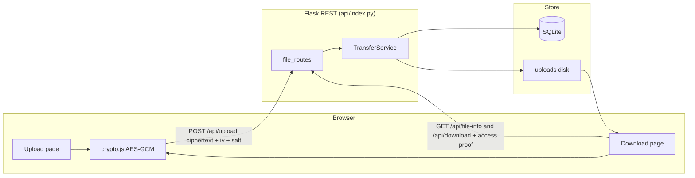
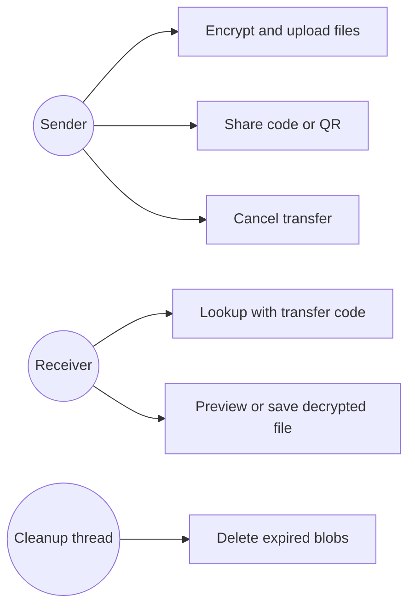
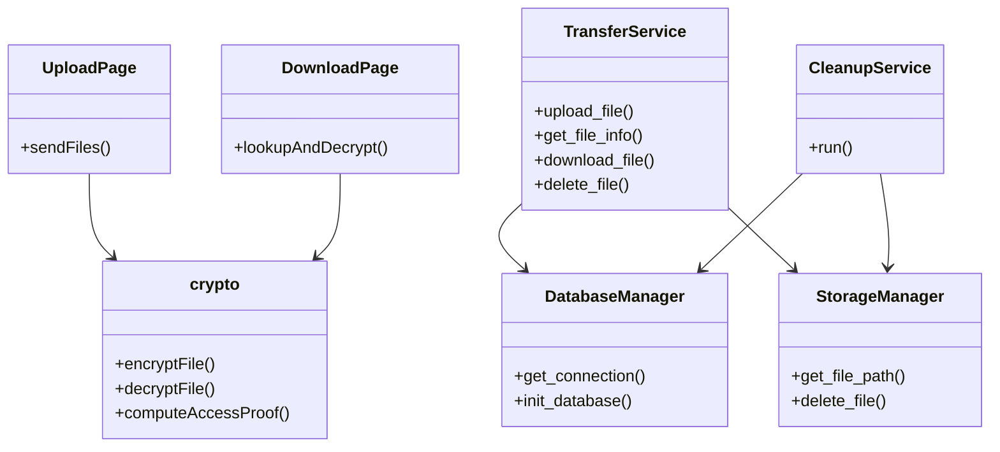

# FileShare

Browser-based encrypted file sharing with no user accounts. Learning / MVP project.

## About

FileShare lets a sender pick files in the browser, encrypt them locally, and upload ciphertext to a Flask API. The recipient pastes a transfer code (`FS-<fileId>-<password>`), downloads the blob, and decrypts it in their own browser.

It exists as a student project to practice client-side crypto, a small REST backend, SQLite metadata, and a React SPA — not as a production file-hosting service.

What it demonstrates:

- AES-256-GCM in the browser (Web Crypto) with PBKDF2
- A share-code access model instead of login
- Flask routes that store ciphertext and metadata, not plaintext
- Optional burn-on-read, download limits, expiry, and in-browser preview

There is **no login, signup, JWT, or user roles**. Anyone with the full transfer code can fetch and decrypt the file.

## MVP Features

- [x] Client-side AES-256-GCM (Web Crypto) + PBKDF2 (100,000 iterations, SHA-256)
- [x] Optional gzip compression before encrypt
- [x] Share code and QR (`FS-<fileId>-<password>`)
- [x] Multi-file packaging (`FSBUNDLE1`, up to 2 GB total)
- [x] Optional PNG steganography vault (skipped if ciphertext is larger than ~10 MB)
- [x] Burn-on-read, download limits, and expiry
- [x] In-browser preview (does not count as a download until a preview cap)
- [x] Access proof derived from the password (file ID alone is not enough)
- [x] Sender cancel via owner token (returned once on upload)
- [x] SQLite metadata + ciphertext on local disk
- [x] Periodic expiry cleanup
- [x] Per-IP sliding-window rate limits

## Architecture

Transfers go through HTTP. Ciphertext is written under `uploads/` (or `/tmp` on Vercel). The AES password stays in the share code and is not posted to the server.



Optional **Direct P2P (same time)** on Send joins a signaling room (`file_id` hex, max two peers). Status can show waiting/connected; **ciphertext still goes over REST** by default. NAT/TURN often fails; treat P2P as experimental.

## UML / System Design

### Use case



### Class



## Tech Stack

| Layer             | Tech                                              |
| ----------------- | ------------------------------------------------- |
| Frontend          | React 18, Vite 5, React Router 6                  |
| UI extras         | lucide-react, qrcode.react                        |
| Crypto / compress | Web Crypto API, Compression Streams               |
| Backend           | Flask 3, Flask-CORS, Flask-SocketIO               |
| Data              | SQLite (WAL), local disk blobs                    |
| Hosting config    | Vercel (`vercel.json` rewrites `/api/*` to Flask) |

## Project Structure

```
FileShare/
├── api/                 Flask app, routes, TransferService, cleanup
├── frontend/            React SPA (Upload, Download, crypto.js)
├── tests/               Backend + Node round-trip tests
├── database/            SQLite at runtime (local)
├── uploads/             Ciphertext blobs at runtime (local)
├── .gitignore
├── Procfile
├── requirements.txt
├── vercel.json
└── README.md
```

## Installation & Run

**Prerequisites:** Python 3.10+ and Node.js 18+

```bash
git clone https://github.com/sujalkathait93-lab/fileshare.git
cd fileshare

pip install -r requirements.txt
python api/index.py
```

In a second terminal:

```bash
cd frontend
npm install
npm run dev
```

- API: `http://localhost:8000`
- UI: `http://localhost:5173` (Vite proxies `/api` to the Flask port)

## Usage

**Sender**

1. Open Send Files (`/upload`).
2. Drop one or more files (2 GB total max).
3. Optionally set burn-on-read, download limit, expiry, or steganography.
4. Confirm. The browser compresses (when it helps), encrypts with AES-256-GCM, and POSTs ciphertext plus an `access_hash` (SHA-256 of `fileshare-access:` + password — never the password itself).
5. Copy the `FS-…` code, QR, or link. Anyone with this code can download. Keep that tab if you want to cancel with the owner token.
6. Optional: enable Direct P2P if both people are online at once. REST remains the fallback.

**Receiver**

1. Open Receive Files (`/download`), or open a link with `?code=FS-…`.
2. Paste the **full** transfer code (id + password).
3. Connect. The client derives the same access proof and sends it as `X-Access-Proof`. File-id-only URLs cannot fetch metadata or ciphertext.
4. Decrypt locally. Preview for ~30 seconds and/or save the file.

## Learning Outcomes

- How AES-GCM, PBKDF2, salt, and IV fit together in Web Crypto
- Why the password can stay off the server while ciphertext still lives on disk
- Splitting a small app into routes, TransferService, DatabaseManager, and StorageManager
- Share-code access vs real authentication (SHA-256 access proof is not a second factor)
- Limits of SQLite + local files on serverless (`/tmp` is not durable)
- Optional WebRTC signaling vs reliable REST transfer

## Limitations

This is a **learning MVP**, not production-ready, fully secure, or scalable.

- Access is the share code. Forwarding the code forwards the file. File ID alone cannot fetch ciphertext (access proof required).
- No accounts or authentication.
- Vercel sets `DB_PATH` and `UPLOAD_DIR` to `/tmp`; metadata and blobs do not persist across instances. `GET /api/health` reports `persistent_storage: false`.
- Optional Direct P2P may fail (NAT/TURN/serverless); REST is the default path.
- In-memory rate limits do not share state across processes.
- Large files still need enough browser memory to handle encrypt/decrypt.
- Playwright UI checks (if you run them) are Chromium-only, not a full browser matrix.
- For anything that should keep files, run locally or on a VM with disk; do not treat Vercel `/tmp` SQLite as durable storage.

## Roadmap

- [ ] Use WebRTC DataChannel for the actual file bytes (today REST still carries the payload)
- [ ] Durable storage if the app is hosted beyond a single disk / ephemeral `/tmp`
- [ ] Decrypt while streaming so large downloads use less RAM

## Author

**sujalkathait93-lab** — student. Built FileShare as a learning project for client-side encryption and a small Flask + React stack.