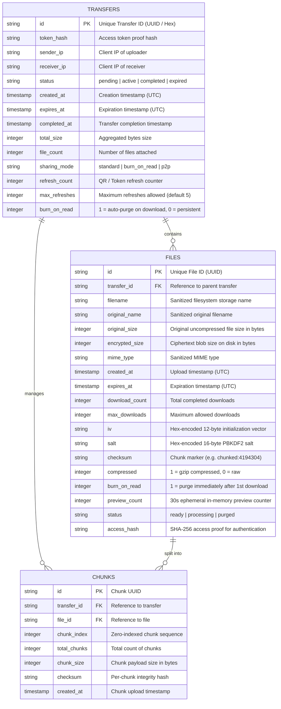
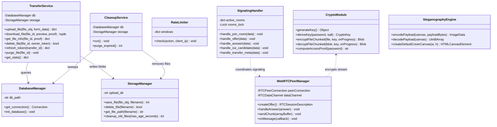
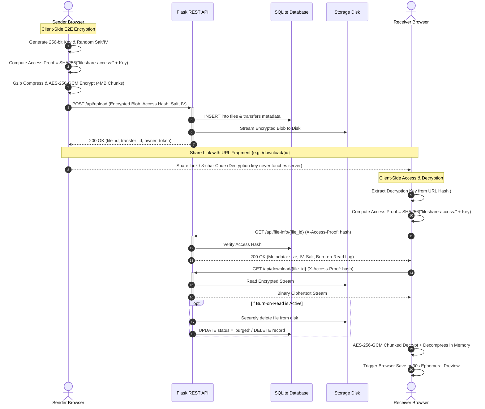
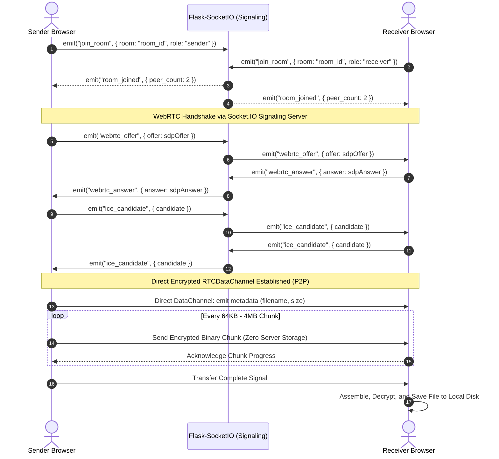

<div align="center">

# FileShare

### *Send, Share and Done — Zero-Knowledge End-to-End Encrypted File Transfer & WebRTC P2P Platform*

[](https://www.python.org/)
[](https://flask.palletsprojects.com/)
[](https://react.dev/)
[](https://vitejs.dev/)
[](https://developer.mozilla.org/en-US/docs/Web/API/Web_Crypto_API)
[](https://webrtc.org/)
[](https://vercel.com/)
[](LICENSE)

<p align="center">
  <strong>FileShare</strong> is a modern, high-speed, zero-knowledge privacy platform designed for frictionless and ultra-secure file transfers. Featuring client-side <strong>AES-256-GCM</strong> chunked encryption, direct browser-to-browser <strong>WebRTC DataChannels</strong>, procedural <strong>steganography pixel concealment</strong>, and ephemeral <strong>Burn-on-Read</strong> transfers.
</p>

[Key Features](#key-features) •
[Architecture & Security Model](#architecture--security-model) •
[ER & UML Diagrams](#er--uml-diagrams) •
[Quick Start](#quick-start) •
[Transfer Modes](#transfer-modes) •
[API Reference](#api--signaling-reference) •
[Testing & Quality Assurance](#testing--quality-assurance)

---

</div>

## Key Features

### True Zero-Knowledge Client-Side Encryption
- **AES-256-GCM Authenticated Encryption**: Plaintext data and keys never touch the server unencrypted.
- **PBKDF2 Key Derivation**: 100,000 SHA-256 iterations with cryptographically random 16-byte salt and 12-byte initialization vectors (IV).
- **Streaming Chunk Encryption (2 GB Scale)**: Large files stream directly from disk using 4 MB chunks with counter-derived per-chunk IVs and 4-byte little-endian length framing, preventing browser memory exhaustion.
- **On-the-Fly Stream Compression**: Integrated client-side `gzip` compression before encryption maximizes transfer speeds and minimizes bandwidth.
- **Cryptographic Access Proofs**: Requires `SHA-256("fileshare-access:<password>")` proof verification before serving metadata or file streams, eliminating unauthorized metadata enumeration.

### Dual Transmission Engine
- **Direct WebRTC P2P DataChannels**: Direct browser-to-browser file streaming over encrypted data channels with Flask-SocketIO signaling and STUN/TURN NAT traversal. Zero bytes stored on any server.
- **Ephemeral Encrypted Cloud Relay**: Stored encrypted blob relay for asynchronous sharing with configurable automatic expiration and cleanup.

### Steganography Image Carrier Vault
- **LSB Pixel Concealment**: Conceal binary payloads directly into standard PNG/canvas image pixel channels (`SECVAULTv1` magic header framing).
- **Procedural Cosmic Artwork Generator**: Automatically generates high-resolution deep-space nebula cover artwork on canvas or embeds payloads into user-uploaded cover images (up to 10 MB payloads / 5000px width).

### Privacy Controls & Ephemeral Security
- **Burn-on-Read**: Instant, irreversible disk and database destruction immediately following first download.
- **Configurable Expiry Lifespans**: Flexible retention timers (5 minutes, 1 hour, 24 hours, 7 days, or custom TTL).
- **Download Limits**: Restrict downloads to 1, 5, 100, or unlimited until expiration.
- **Short Transfer Codes & Dynamic QR Codes**: Effortless cross-device access with human-friendly 8-character codes and live QR codes with anti-replay refresh limiting.
- **In-Browser Ephemeral Preview**: Decrypts and renders images, PDFs, videos, and text files directly into memory for 30 seconds without writing to disk.
- **Hardened Security Headers**: Enterprise-grade CSP, HSTS, X-Content-Type-Options, X-Frame-Options (`DENY`), and Permissions-Policy.
- **In-Memory Sliding-Window Rate Limiter**: Built-in DDoS, spam, and brute-force prevention on all sensitive endpoints.

---

## Architecture & Security Model

```
┌─────────────────────────────────────────────────────────────────────────────────┐
│                                 SENDER BROWSER                                  │
│                                                                                 │
│   [ Plaintext File ]                                                            │
│           │                                                                     │
│           ▼ (Client-Side Compression)                                           │
│   [ Gzip Stream ]                                                               │
│           │                                                                     │
│           ▼ (Client-Side Web Crypto API)                                        │
│   [ AES-256-GCM 4MB Chunks + PBKDF2 (100k iter) ]                              │
│           │                                                                     │
│           ├───────────────────────────────────┬─────────────────────────────────┤
│           ▼                                   ▼                                 │
│   [ Steganography Encoder ]         [ P2P DataChannel ]             [ HTTP POST ]
│   (LSB Canvas Canvas Pixels)        (WebRTC Encrypted)         (Encrypted Blob Only)
└───────────┬───────────────────────────────────┼─────────────────────────────────┼───┘
            │                                   │                                 │
            │                                   │                                 ▼
            │                        ┌──────────────────────┐        ┌──────────────────────┐
            │                        │   Socket.IO Signal   │        │  Flask REST Backend  │
            │                        │  (Room Coordination) │        │  (SQLite + Temp Dir) │
            │                        └──────────┬───────────┘        └──────────┬───────────┘
            │                                   │                               │
            ▼                                   ▼                               ▼
┌─────────────────────────────────────────────────────────────────────────────────┐
│                                RECEIVER BROWSER                                 │
│                                                                                 │
│   [ Decryption Key from URL Hash (#key=...) or Transfer Code ]                   │
│   (Decryption key is NEVER transmitted across HTTP requests)                    │
│                                                                                 │
│           ▲                                   ▲                               ▲ │
│           │                                   │                               │ │
│   [ Stego Extract ]                 [ RTCDataChannel Recv ]         [ HTTP GET Blob ]
│           │                                   │                               │ │
│           └───────────────────────────────────┴───────────────────────────────┘ │
│                                               │                                 │
│                                               ▼                                 │
│                               [ AES-256-GCM Chunk Decryption ]                  │
│                                               │                                 │
│                                               ▼ (Decompression)                 │
│                                     [ Decompressed Stream ]                     │
│                                               │                                 │
│                                               ▼                                 │
│                         [ Restored File / Ephemeral 30s Preview ]               │
└─────────────────────────────────────────────────────────────────────────────────┘
```

---

## ER & UML Diagrams

### 1. Database Entity-Relationship (ER) Diagram

The SQLite database operates in **WAL (Write-Ahead Logging)** mode with optimized indexes for fast expiry sweeps and token queries.



---

### 2. UML Software Architecture & Class Diagram



---

### 3. UML Sequence Diagram: Zero-Knowledge Cloud Relay



---

### 4. UML Sequence Diagram: WebRTC P2P Direct Wire Transfer



---

## Repository Structure

```
fileshare/
├── api/                        # Flask Backend & WebRTC Signaling Service
│   ├── index.py                # App factory, error handlers, security headers, cleanup thread
│   ├── config.py               # Environment variables, STUN/TURN configs, rate limits
│   ├── database.py             # SQLite database layer with auto-migration schema
│   ├── storage.py              # File storage manager with chunk writing & secure deletion
│   ├── validation.py           # Input sanitization, MIME checks & schema validation
│   ├── rate_limit.py           # In-memory sliding window rate limiter
│   ├── errors.py               # Standardized hierarchical API error classes
│   ├── utils.py                # IP detection, timestamps & formatting helpers
│   ├── routes/
│   │   ├── file_routes.py      # REST API endpoints (upload, download, info, refresh, stats)
│   │   └── signaling.py        # WebSockets WebRTC signaling handlers (Socket.IO)
│   └── services/
│       ├── transfer_service.py # Domain business logic for transfers & access proofs
│       └── cleanup_service.py  # Background garbage collection for expired files
├── frontend/                   # Modern React + Vite Single Page Application
│   ├── src/
│   │   ├── App.jsx             # Root application component with routing & navigation
│   │   ├── App.css             # High-polish responsive design system & animations
│   │   ├── crypto.js           # Web Crypto API AES-256-GCM chunked encryption/decryption
│   │   ├── steganography.js    # Canvas LSB pixel encoding & procedural cosmic cover art
│   │   ├── chunkManager.js     # Memory-safe client-side streaming & chunk processing
│   │   ├── fileManager.js      # File lifecycle orchestration & format conversions
│   │   ├── transferCode.js     # Short transfer codes & access link generation
│   │   ├── previewManager.js   # 30-second ephemeral in-memory preview controller
│   │   ├── compression.js      # CompressionStreams API / pako gzip utilities
│   │   ├── stateMachine.js     # Transfer state management & UI transitions
│   │   ├── pages/
│   │   │   ├── Upload.jsx      # Upload interface (drag-and-drop, options, QR codes)
│   │   │   └── Download.jsx    # Download portal (key entry, preview, download progress)
│   │   ├── components/         # UI component library & feedback animations
│   │   │   ├── Skeletons.jsx   # Polished placeholder loaders
│   │   │   └── FeedbackStates.jsx # Success, error, and progress dialogs
│   │   └── webrtc/             # P2P WebRTC subsystem
│   │       ├── PeerManager.js      # RTCPeerConnection wrapper & ICE candidate handler
│   │       ├── SenderChannel.js    # RTCDataChannel streaming chunk sender
│   │       ├── ReceiverChannel.js  # RTCDataChannel buffer receiver & integrity verifier
│   │       └── SignalingClient.js  # Socket.IO client signaling adapter
│   ├── package.json            # Frontend dependencies & scripts
│   └── vite.config.js          # Vite build configuration with proxy rules
├── tests/                      # Automated Test Suites
│   ├── test_backend.py         # Comprehensive 20-scenario Python backend test suite
│   ├── crypto-roundtrip.mjs    # Node.js cryptographic encryption/decryption verification
│   └── preview-and-states.test.mjs # State machine and preview validation tests
├── database/                   # SQLite database storage directory
├── uploads/                    # Local encrypted file blob storage directory
├── Procfile                    # Production Gunicorn process configuration
├── vercel.json                 # Vercel serverless deployment specification
└── requirements.txt            # Python backend dependencies
```

---

## Quick Start

### Prerequisites
- **Python**: 3.11 or higher
- **Node.js**: 18.0.0 or higher
- **npm**: 9.0.0 or higher

---

### 1. Clone & Set Up the Backend

```bash
# Clone repository
git clone https://github.com/your-username/fileshare.git
cd fileshare

# Create and activate Python virtual environment
# On Linux / macOS:
python3 -m venv .venv
source .venv/bin/activate

# On Windows (PowerShell):
python -m venv .venv
.venv\Scripts\Activate.ps1

# Install backend dependencies
pip install -r requirements.txt
```

### 2. Set Up & Launch the Frontend

In a separate terminal:

```bash
cd frontend
npm install
npm run dev
```

The frontend will start at **`http://localhost:5173`** and automatically proxy API requests to the Flask backend.

### 3. Launch the Backend Server

```bash
# In the project root with the virtual environment activated:
python api/index.py
```

The backend server runs on **`http://localhost:8000`** with live Socket.IO WebRTC signaling enabled.

---

## Transfer Modes

| Feature | Ephemeral Cloud Relay | WebRTC P2P Direct | Steganography Vault |
| :--- | :--- | :--- | :--- |
| **Data Storage** | Encrypted blob on server | **Zero server storage** | Embedded in image file |
| **Max File Size** | Up to **2 GB** | Browser memory bounded | Up to **10 MB** (Canvas limit) |
| **Receiver Requirement**| Asynchronous (can download later)| Synchronous (both online) | Asynchronous (share as image) |
| **Encryption** | AES-256-GCM + PBKDF2 | AES-256-GCM + DTLS | AES-256-GCM + LSB Pixel |
| **Burn-on-Read** | Supported | Direct stream | N/A (Standard image file) |
| **Best For** | Large files, mobile sharing | Highest privacy, instant P2P | Covert transmission |

---

## API & Signaling Reference

### REST API Endpoints

All responses are formatted in strict JSON, and errors return standardized RFC 7807-compatible payloads.

#### `POST /api/upload`
Upload an encrypted file blob.
- **Headers**: `Content-Type: multipart/form-data`
- **Form Data**:
  - `file`: Encrypted binary blob (`application/octet-stream`).
  - `original_name`: Sanitized original filename.
  - `iv`: 12-byte hex-encoded initialization vector.
  - `salt`: 16-byte hex-encoded PBKDF2 salt.
  - `access_hash`: Cryptographic SHA-256 access proof.
  - `burn_on_read`: `1` or `0`.
  - `expires_in`: Expiration in seconds (e.g., `3600`).
  - `max_downloads`: Maximum allowed downloads (e.g., `5`).
  - `checksum`: `chunked:4194304` or empty for legacy files.

#### `GET /api/file-info/<file_id>`
Retrieve file metadata without downloading the encrypted payload.
- **Headers**: `X-Access-Proof: <sha256_hash>`

#### `GET /api/download/<file_id>`
Stream the encrypted file blob.
- **Headers**: `X-Access-Proof: <sha256_hash>`
- **Query Params**: `?preview=true` (optional for 30s preview)

#### `POST /api/transfers/<transfer_id>/token/refresh`
Refresh the transfer token and rotate the QR code (max 5 refreshes per session).

#### `DELETE /api/files/<file_id>`
Immediately purge a file from disk and database.
- **Headers**: `X-Owner-Token: <token>`

#### `GET /api/health`
Service health check and environment status.

#### `GET /api/network-info`
Provides local network IP addresses and active STUN/TURN server configurations.

#### `GET /api/stats`
Aggregate transfer statistics (total files hosted, active transfers, purged count).

---

### Socket.IO WebRTC Signaling Events

| Event | Direction | Payload / Description |
| :--- | :--- | :--- |
| `join_room` | Client ➔ Server | `{ room: string, role: "sender" \| "receiver" }` |
| `room_joined` | Server ➔ Client | `{ room: string, role: string, peer_count: number }` |
| `webrtc_offer` | Bidirectional | Relay SDP Offer between room peers |
| `webrtc_answer` | Bidirectional | Relay SDP Answer between room peers |
| `ice_candidate` | Bidirectional | Exchange ICE Candidates for NAT traversal |
| `transfer_meta` | Sender ➔ Receiver | `{ filename, size, mimeType, chunksCount }` |
| `transfer_progress` | Bidirectional | Broadcast percentage & transfer speed metrics |
| `transfer_complete`| Bidirectional | Finalize transfer and acknowledge integrity |

---

## Testing & Quality Assurance

FileShare includes comprehensive unit, integration, cryptographic, and end-to-end testing suites.

```bash
# 1. Run Python Backend Integration & Scenario Suite (20 Scenarios)
python -m unittest tests/test_backend.py -v

# 2. Run Node.js Cryptographic Roundtrip Verification
node tests/crypto-roundtrip.mjs

# 3. Run State Machine & Preview Validation Tests
node tests/preview-and-states.test.mjs

# 4. Run Playwright End-to-End Browser Tests
cd frontend
npm run test:e2e
```

### Backend Test Scenarios Covered:
- Single & multi-file transfers with QR and short codes
- Multi-user concurrent access with access proof validation
- Download limits enforcement (1, 5, 100, and unlimited)
- Automatic expiration and TTL purge cycles
- Burn-on-read instant file wiping
- Ephemeral in-memory image & PDF preview streams
- 2 GB large file chunked upload/download validation
- Rate-limiter sliding window exhaustion & recovery
- Anti-tamper & malformed ciphertext handling

---

## Security Best Practices & Zero-Knowledge Guarantee

1. **URL Hash Fragment Security**: Decryption keys are stored in the URL fragment identifier (`#key=...`). According to RFC 3986, fragment identifiers are never sent to the server in HTTP request headers.
2. **Access Proof Authentication**: The server never receives or verifies raw decryption passwords. The client derives a one-way `SHA-256` proof string to authenticate metadata and blob downloads.
3. **No Unencrypted Persistence**: File content is encrypted on the client before being sent over the wire and is stored on disk strictly as an encrypted ciphertext blob.
4. **Memory Hygiene**: Ephemeral file previews are decrypted into client memory blob URLs and automatically revoked and released after 30 seconds.

---

## License

This project is licensed under the **MIT License** — see the [LICENSE](LICENSE) file for details.

---

<div align="center">
  <sub>Built for privacy, security, and open-source software.</sub>
</div>
