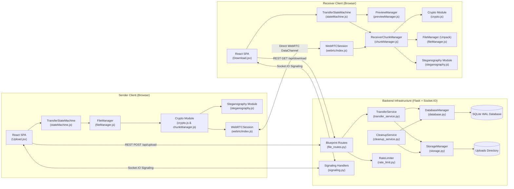
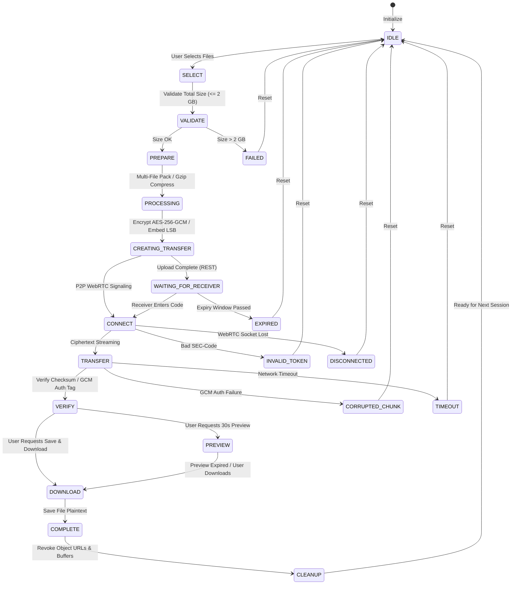
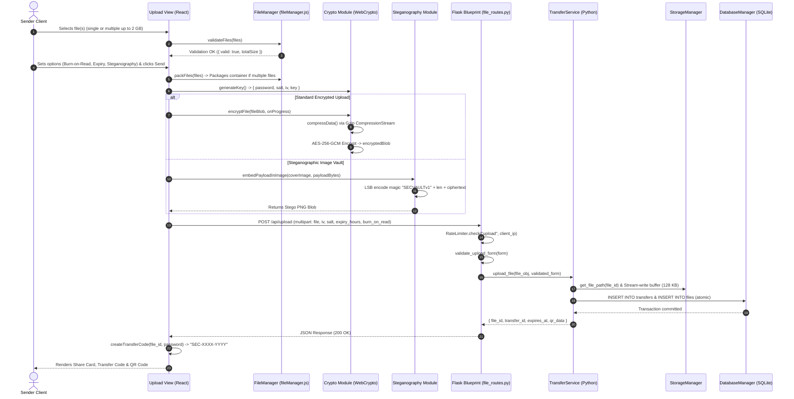
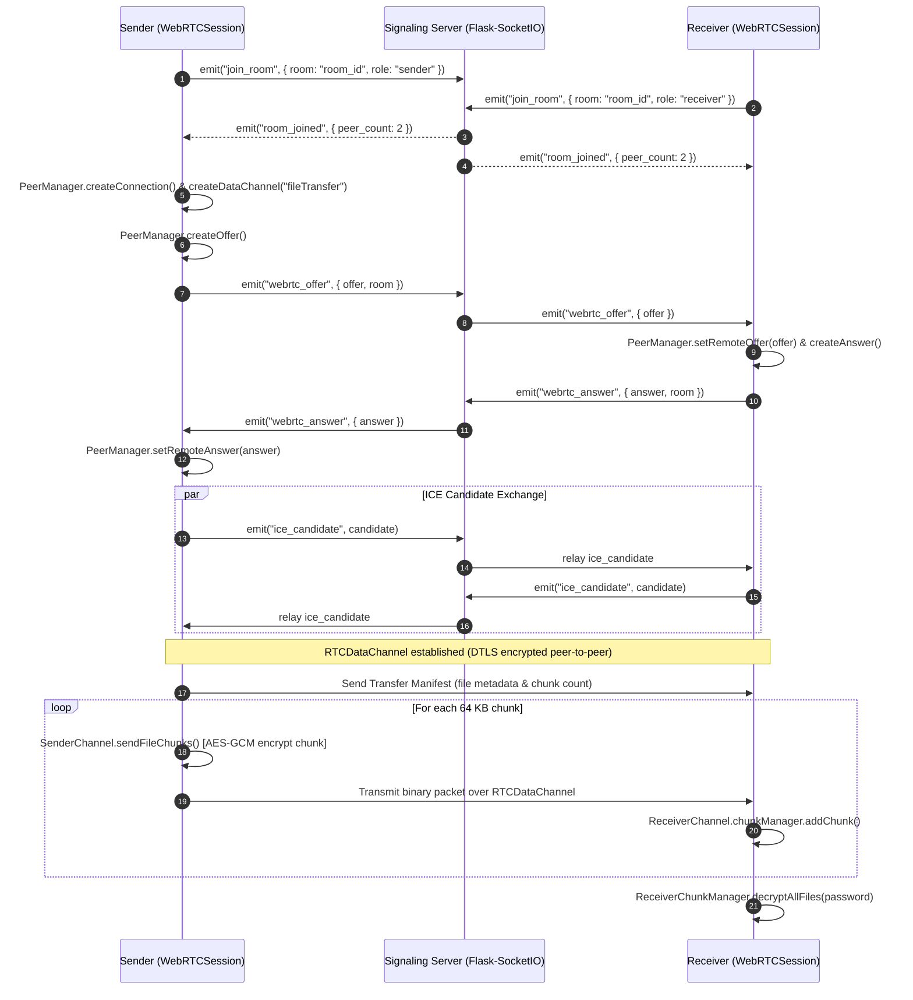
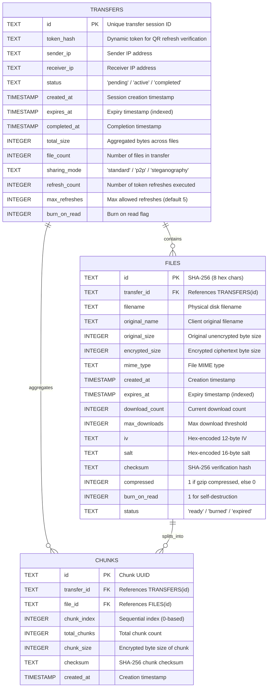

# FileShare

**Simple and secure file sharing — end-to-end encrypted, zero-knowledge storage, with an optional steganographic vault, universal 30-second preview, multi-file packaging up to 2 GB, and direct peer-to-peer transfer.**

FileShare is built on a strict zero-trust architecture: compression, encryption, multi-file container bundling, and steganographic pixel-encoding happen inside the sender's browser via native Web Crypto APIs before any payload touches the network. The backend server acts strictly as an encrypted ciphertext store and WebRTC signaling matchmaker — it never receives plaintext, passwords, or encryption keys.

---

## Table of Contents

1. [Why FileShare](#why-fileshare)
2. [Key Features](#key-features)
3. [How It Works](#how-it-works)
4. [Architecture & UML Diagrams](#architecture--uml-diagrams)
   - [High-Level System Overview](#high-level-system-overview)
   - [UML Class Diagram (Backend & Frontend OOP)](#uml-class-diagram-backend--frontend-oop)
   - [UML State Machine Diagram (Transfer Lifecycle)](#uml-state-machine-diagram-transfer-lifecycle)
   - [UML Sequence Diagram: Upload & Multi-File Packaging Flow](#uml-sequence-diagram-upload--multi-file-packaging-flow)
   - [UML Sequence Diagram: Download, 30-Second Preview & Decryption Flow](#uml-sequence-diagram-download-30-second-preview--decryption-flow)
   - [UML Sequence Diagram: WebRTC P2P Signaling & Streaming](#uml-sequence-diagram-webrtc-p2p-signaling--streaming)
   - [Database Entity-Relationship (ER) Diagram](#database-entity-relationship-er-diagram)
   - [System Deployment Diagram](#system-deployment-diagram)
5. [Object-Oriented Programming (OOP) & SOLID Principles](#object-oriented-programming-oop--solid-principles)
   - [OOP Core Pillars in the Codebase](#oop-core-pillars-in-the-codebase)
   - [SOLID Principles Implementation Breakdown](#solid-principles-implementation-breakdown)
6. [Low-Level Design (LLD) Modules & Codebase Reference](#low-level-design-lld-modules--codebase-reference)
   - [Frontend JavaScript Architecture](#frontend-javascript-architecture)
   - [Backend Python Architecture](#backend-python-architecture)
7. [Universal 30-Second Preview Engine](#universal-30-second-preview-engine)
8. [Mobile-First Responsiveness (320px – 430px)](#mobile-first-responsiveness-320px--430px)
9. [Technology Stack](#technology-stack)
10. [Cryptography & Security Deep Dive](#cryptography--security-deep-dive)
11. [Share Code Specification](#share-code-specification)
12. [REST & Realtime API Reference](#rest--realtime-api-reference)
13. [Project Structure](#project-structure)
14. [Local Development & Automated Testing](#local-development--automated-testing)
15. [Deployment](#deployment)
16. [Security Guarantees](#security-guarantees)

---

## Why FileShare

Most "secure" file-sharing tools ask you to trust a remote server. FileShare doesn't ask — it is designed so the server *cannot* betray that trust even if compromised:

- Your file is encrypted **before** it leaves your browser.
- The decryption key is **never** sent to or stored on the server.
- One short share code is all a recipient needs — nothing to install, nothing to configure.
- Universal **30-second temporary preview** lets recipients inspect photos, video, audio, PDFs, and code without permanently saving or triggering premature burn-on-read destruction.
- Files self-destruct on read or after a configurable timer, leaving no trace behind on disk or in the database.

---

## Key Features

- **Zero-Knowledge Architecture** — Client-side AES-256-GCM encryption ensures decryption keys and passwords never reach the server.
- **Universal 30-Second Preview** — Live countdown timer, automatic modal dismissal, and memory/URL revocation across all file types (images, videos, audio, PDF, text/code, and metadata info screens for unsupported binary formats).
- **Multi-File Bundling (Up to 2 GB Total)** — Seamlessly selects, validates, and packages multiple files into a unified container manifest without high memory overhead.
- **Steganographic Image Vault** — Encrypted payloads can be embedded into the least-significant bits (LSB) of PNG pixel channels (`SECVAULTv1`), disguising confidential data as standard artwork.
- **High-Capacity Streaming Engine** — Slice-by-slice chunk generator supporting transfers up to 2 GB without buffering entire blobs into browser RAM.
- **Burn-on-Read Auto-Purge** — Files and database metadata are atomically purged from disk and SQLite upon first successful download (while preview remains non-destructive).
- **Atomic Concurrency & Limits** — SQLite WAL mode with atomic `UPDATE ... WHERE download_count < max_downloads` eliminates race conditions.
- **Token Refresh Protection** — Dynamic token rotation with a hard limit of 5 refreshes per session to prevent brute-force probing.
- **WebRTC P2P Transfers** — Direct browser-to-browser DataChannels coordinated by a Flask-SocketIO signaling server with STUN/TURN NAT traversal.
- **Mobile-First Responsive Design** — Optimized for 320px, 375px, 390px, and 430px viewports (iPhone SE, iPhone 12/13/14/15/16 Pro, Galaxy, Pixel) with touch-first controls and safe-area notch padding.

---

## How It Works

FileShare operates across three cryptographic and transport layers:

```
[ Sender Browser ] ─── (Multi-File Pack) ───► [ PBKDF2 Key Derivation ] ───► [ AES-256-GCM Encrypt ]
                                                                                       │
                                 ┌─────────────────────────────────────────────────────┴────────────────┐
                                 ▼                                                                      ▼
                      [ LSB Steganography ]                                                   [ REST / WebRTC ]
                   Embedded into PNG Pixels                                               Chunked Ciphertext Stream
                                 │                                                                      │
                                 ▼                                                                      ▼
                      [ Cover Image Output ]                                                  [ Server / Peer Store ]
```

1. **Client-Side Key Derivation & Encryption**: The sender generates a cryptographic random salt (16 bytes) and IV (12 bytes). PBKDF2 derives an AES-GCM 256-bit key from the password over 100,000 iterations with SHA-256. The file is compressed via `CompressionStream('gzip')` and encrypted via `crypto.subtle.encrypt()`.
2. **Multi-File Container (Optional)**: When multiple files are selected, `fileManager.js` bundles them with a binary manifest header (`FSBUNDLE1`) containing relative file paths, byte sizes, and MIME types.
3. **Steganographic Embedding (Optional)**: If enabled, encrypted bytes are encoded into the RGB pixel channels' least-significant bits of a canvas-generated PNG image, prepended with a 10-byte magic header (`SECVAULTv1`) and a 4-byte length integer.
4. **Distribution & Universal 30-Sec Preview**: The recipient parses the share code (`SEC-<FILE_ID>-<PASSWORD>`), fetches metadata, previews content safely inside an active 30s auto-closing window (using non-destructive `?preview=true`), or executes final decryption and save (which triggers server burn-on-read).

---

## Architecture & UML Diagrams

### High-Level System Overview



---

### UML Class Diagram (Backend & Frontend OOP)

```mermaid
classDiagram
    direction TB

    %% Backend Python Architecture
    class DatabaseManager {
        +string db_path
        +get_connection() sqlite3.Connection
        +init_database() void
    }

    class StorageManager {
        +string upload_dir
        +get_file_path(file_id) string
        +get_chunk_path(transfer_id, file_id, chunk_index) string
        +file_exists(file_id) bool
        +delete_file(file_id) void
        +purge_transfer_chunks(transfer_id) void
        +list_upload_files() list~str~
    }

    class RateLimiter {
        +dict limits
        +defaultdict _hits
        +Lock _lock
        +is_allowed(bucket, key) bool
        +check(bucket, key) void
    }

    class TransferService {
        +DatabaseManager db
        +StorageManager storage
        +upload_file(file_obj, form_data) dict
        +refresh_token(transfer_id) dict
        +get_file_info(file_id) dict
        +download_file(file_id, preview) tuple
        +purge_file(file_id) void
        +delete_file(file_id) void
        +get_stats() dict
    }

    class CleanupService {
        +DatabaseManager db
        +StorageManager storage
        +run() void
    }

    class ApiError {
        +int status_code
        +string detail
        +to_dict() dict
    }

    class NotFoundError {
        +int status_code = 404
        +string detail = "Resource not found"
    }
    class ConflictError {
        +int status_code = 409
        +string detail = "Resource conflict"
    }
    class GoneError {
        +int status_code = 410
        +string detail = "Resource has been deleted"
    }
    class ValidationError {
        +int status_code = 400
        +string detail = "Invalid request data"
    }
    class PayloadTooLargeError {
        +int status_code = 413
        +string detail = "Payload too large"
    }
    class RateLimitError {
        +int status_code = 429
        +dict headers
    }

    ApiError <|-- NotFoundError
    ApiError <|-- ConflictError
    ApiError <|-- GoneError
    ApiError <|-- ValidationError
    ApiError <|-- PayloadTooLargeError
    ApiError <|-- RateLimitError

    TransferService --> DatabaseManager : Uses (DIP)
    TransferService --> StorageManager : Uses (DIP)
    CleanupService --> DatabaseManager : Uses (DIP)
    CleanupService --> StorageManager : Uses (DIP)

    %% Frontend JavaScript Architecture
    class TransferStateMachine {
        +string state
        +object context
        +Set listeners
        +transition(event, payload) string
        +transitionTo(state, payload) string
        +subscribe(listener) function
        +getState() string
        +getContext() object
        +reset() void
    }

    class FileManager {
        +detectFileType(fileName, mimeType) object
        +validateFiles(files) object
        +packFiles(files) Promise~object~
        +unpackFiles(bytes, name, mime) object
        +formatBytes(bytes) string
    }

    class PreviewManager {
        +number secondsLeft
        +Set activeObjectUrls
        +object currentPreview
        +preparePreview(fileItem) object
        +startCountdown() void
        +stopCountdown() void
        +close() void
        +cleanup() void
    }

    class ReceiverChunkManager {
        +Array manifest
        +Map filesMap
        +object receivedStats
        +addChunk(fileId, chunkIndex, totalChunks, chunkData, checksum) object
        +decryptAndAssembleFile(fileId, key, baseIV) Promise~object~
        +decryptAllFiles(password) Promise~Array~
    }

    class WebRTCSession {
        +string role
        +string roomCode
        +string serverUrl
        +SignalingClient signaling
        +PeerManager peerManager
        +SenderChannel senderChannel
        +ReceiverChannel receiverChannel
        +initSignaling(callbacks) Promise~void~
        +createPeerConnection() void
        +startWebRTCSender() Promise~void~
        +handleWebRTCOffer(offer) Promise~void~
        +sendFiles(files, password, onProgress) Promise~void~
        +pause() void
        +resume() void
        +destroy() void
    }

    class SignalingClient {
        +string serverUrl
        +Socket socket
        +Map listeners
        +connect() void
        +joinRoom(room, role) void
        +sendOffer(room, offer) void
        +sendAnswer(room, answer) void
        +sendCandidate(room, candidate) void
        +sendTransferMeta(room, meta) void
        +requestResume(room, lastChunkIndex) void
        +sendStatus(room, status) void
        +leaveRoom(room) void
        +disconnect() void
    }

    class PeerManager {
        +object config
        +RTCPeerConnection peerConnection
        +createConnection(onIceCandidate, onDataChannel) RTCPeerConnection
        +createOffer() Promise~RTCSessionDescriptionInit~
        +createAnswer() Promise~RTCSessionDescriptionInit~
        +setRemoteOffer(offer) Promise~void~
        +setRemoteAnswer(answer) Promise~void~
        +addIceCandidate(candidate) Promise~void~
        +close() void
    }

    class SenderChannel {
        +RTCDataChannel dataChannel
        +boolean isPaused
        +number currentChunkIndex
        +sendFileChunks(file, key, iv, onProgress) Promise~void~
        +pause() void
        +resume() void
    }

    class ReceiverChannel {
        +RTCDataChannel dataChannel
        +ReceiverChunkManager chunkManager
        +setupListeners(onProgress, onComplete, onError) void
    }

    WebRTCSession *-- SignalingClient : Composes
    WebRTCSession *-- PeerManager : Composes
    WebRTCSession *-- SenderChannel : Composes
    WebRTCSession *-- ReceiverChannel : Composes
    ReceiverChannel o-- ReceiverChunkManager : Integrates
```



---

### UML State Machine Diagram (Transfer Lifecycle)



---

### UML Sequence Diagram: Upload & Multi-File Packaging Flow



---

### UML Sequence Diagram: Download, 30-Second Preview & Decryption Flow

```mermaid
sequenceDiagram
    autonumber
    actor Recipient as Receiver Client
    participant UI as Download View (React)
    participant PM as PreviewManager (previewManager.js)
    participant FM as FileManager (fileManager.js)
    participant API as Flask Blueprint (file_routes.py)
    participant TS as TransferService (Python)
    participant DBM as DatabaseManager (SQLite)
    participant SM as StorageManager
    participant Crypto as Crypto Module (WebCrypto)

    Recipient->>UI: Inputs Transfer Code "SEC-4BE819D7-9F8A73C2"
    UI->>UI: parseTransferCode(input) -> { fileId: "4be819d7", key: "9f8a73c2" }
    UI->>API: GET /api/file-info/4be819d7
    API->>TS: get_file_info("4be819d7")
    TS->>DBM: SELECT * FROM files WHERE id = ? AND expires_at > now()
    DBM-->>TS: Metadata record
    TS-->>API: Return JSON Metadata (name, size, iv, salt, burn_on_read)
    API-->>UI: Return JSON Metadata

    alt User clicks "30-Sec Preview" (Non-Destructive)
        UI->>API: GET /api/download/4be819d7?preview=true
        API->>TS: download_file("4be819d7", preview=True)
        TS->>SM: Stream ciphertext buffer without incrementing download_count
        TS-->>API: Ciphertext stream
        API-->>UI: Ciphertext stream
        UI->>Crypto: decryptFile(encryptedData, password, iv, salt)
        Crypto-->>UI: Decrypted Uint8Array
        UI->>FM: unpackFiles(decryptedBytes) -> Single file or Bundle list
        UI->>PM: preparePreview(fileItem) -> Allocates Object URL & starts 30s timer
        PM-->>UI: Render Image/Video/Audio/PDF/Code or Info Screen
        Note over UI,PM: Live 30s Countdown running; at 0s automatically closes modal & revokes Object URL
    end

    alt User clicks "Save & Download" (Burn-on-Read active)
        UI->>API: GET /api/download/4be819d7
        API->>TS: download_file("4be819d7", preview=False)
        TS->>DBM: Atomic UPDATE files SET download_count = download_count + 1 WHERE id = ?
        TS->>SM: Stream ciphertext buffer from disk
        TS-->>API: Ciphertext stream with headers
        API-->>UI: Ciphertext stream with headers
        opt If Burn-on-Read is active
            TS->>TS: purge_file("4be819d7") -> Atomically deletes file from disk and DB
        end
        UI->>Crypto: decryptFile(encryptedData, password, iv, salt)
        UI->>FM: unpackFiles(decryptedBytes)
        UI-->>Recipient: Triggers browser file download save
    end
```

---

### UML Sequence Diagram: WebRTC P2P Signaling & Streaming



---

### Database Entity-Relationship (ER) Diagram



---

### System Deployment Diagram

```mermaid
flowchart TD
    subgraph ClientDevices["Client Tier (Browsers)"]
        D1["Desktop Browser (Chrome/Firefox/Edge)"]
        M1["Mobile Browser (iOS Safari / Android Chrome: 320px - 430px)"]
    end

    subgraph CDN_Gateway["Edge & Reverse Proxy Tier"]
        VercelEdge["Vercel Edge / Reverse Proxy / Nginx"]
    end

    subgraph AppTier["Application Server Tier"]
        Gunicorn["Gunicorn WSGI / Flask Runner (Port 8000)"]
        subgraph FlaskApp["Flask Application Factory (create_app)"]
            REST["REST Blueprint (/api/*)"]
            SocketIO["Flask-SocketIO (WebRTC Signaling)"]
            Cleanup["Daemon Cleanup Thread"]
        end
    end

    subgraph DataTier["Storage & Persistence Tier"]
        DB[(SQLite Database with WAL Mode)]
        Storage[(Local / Ephemeral Disk Storage)]
    end

    subgraph STUNTURN["NAT Traversal Tier"]
        STUN["STUN Servers (Google, Twilio)"]
        TURN["TURN Relays (Metered.ca OpenRelay)"]
    end

    D1 -->|HTTPS / WSS| VercelEdge
    M1 -->|HTTPS / WSS| VercelEdge
    VercelEdge --> Gunicorn
    Gunicorn --> REST
    Gunicorn --> SocketIO
    REST --> DB
    REST --> Storage
    Cleanup --> DB
    Cleanup --> Storage
    D1 <..>|ICE Resolution| STUN
    M1 <..>|Relay Fallback| TURN
    D1 <-->|WebRTC DataChannel (Direct P2P)| M1
```

---

## Object-Oriented Programming (OOP) & SOLID Principles

The FileShare codebase adheres to standard OOP patterns and SOLID principles across backend Python services and frontend JavaScript modules.

### OOP Core Pillars in the Codebase

1. **Encapsulation**:
   - `PreviewManager` (`frontend/src/previewManager.js`) encapsulates the 30-second interval timer, active Object URL tracking, and revocation logic.
   - `RateLimiter` (`api/rate_limit.py`) encapsulates timestamp hits and threading mutex locks, exposing only `is_allowed()` and `check()`.
   - `ReceiverChunkManager` (`frontend/src/chunkManager.js`) encapsulates chunk storage arrays and deduplication maps.
2. **Abstraction**:
   - `FileManager` (`frontend/src/fileManager.js`) abstracts binary container packaging (`FSBUNDLE1`), manifest extraction, and MIME category detection.
   - `StorageManager` (`api/storage.py`) hides OS filesystem path manipulations and file deletion behind high-level methods.
   - `PeerManager` (`frontend/src/webrtc/PeerManager.js`) abstracts WebRTC connection handshakes from UI components.
3. **Inheritance**:
   - `ApiError` (`api/errors.py`) serves as the base class for domain-specific exceptions (`NotFoundError`, `ConflictError`, `GoneError`, `ValidationError`, `PayloadTooLargeError`, `RateLimitError`).
4. **Polymorphism**:
   - Centralized error handling in `api/index.py` handles any instance inheriting from `ApiError` polymorphically, extracting `.status_code`, `.detail`, and `.to_dict()` uniformly.

---

### SOLID Principles Implementation Breakdown

```
┌─────────────────────────────────────────────────────────────────────────────────────────────┐
│                                SOLID DESIGN PRINCIPLES                                      │
├─────────┬─────────────────────────────────┬─────────────────────────────────────────────────┤
│ Concept │ Definition                      │ FileShare Codebase Implementation               │
├─────────┼─────────────────────────────────┼─────────────────────────────────────────────────┤
│ S - SRP │ Single Responsibility Principle │ Decoupled StorageManager, DatabaseManager,      │
│         │                                 │ PreviewManager, FileManager, and TransferService│
├─────────┼─────────────────────────────────┼─────────────────────────────────────────────────┤
│ O - OCP │ Open / Closed Principle         │ ApiError hierarchy & WebRTC Channel handlers    │
│         │                                 │ extensible without altering core dispatchers    │
├─────────┼─────────────────────────────────┼─────────────────────────────────────────────────┤
│ L - LSP │ Liskov Substitution Principle   │ All ApiError subclasses cleanly substitute base │
│         │                                 │ exception in Flask error handling pipelines     │
├─────────┼─────────────────────────────────┼─────────────────────────────────────────────────┤
│ I - ISP │ Interface Segregation Principle │ Focused React hooks (useFileUpload,             │
│         │                                 │ useEncryptAndSend, useDownload) avoid monoliths │
├─────────┼─────────────────────────────────┼─────────────────────────────────────────────────┤
│ D - DIP │ Dependency Inversion Principle  │ Dependency Injection in create_app() passes     │
│         │                                 │ database and storage instances to services      │
└─────────┴─────────────────────────────────┴─────────────────────────────────────────────────┘
```

---

## Low-Level Design (LLD) Modules & Codebase Reference

### Frontend JavaScript Architecture

| Module / Class | Source File | Responsibility |
| :--- | :--- | :--- |
| `FileManager` | [`frontend/src/fileManager.js`](file:///c:/Users/LENOVO/Desktop/python/secureshare/frontend/src/fileManager.js) | Native multi-file selection, 2 GB size validation, `FSBUNDLE1` container packing & unpacking, and MIME type categorization. |
| `PreviewManager` | [`frontend/src/previewManager.js`](file:///c:/Users/LENOVO/Desktop/python/secureshare/frontend/src/previewManager.js) | Universal 30-second temporary preview lifecycle, live countdown ticker, Object URL allocation, and automatic memory cleanup. |
| `TransferStateMachine` | [`frontend/src/stateMachine.js`](file:///c:/Users/LENOVO/Desktop/python/secureshare/frontend/src/stateMachine.js) | Deterministic finite state machine orchestrating stages (`SELECT`, `VALIDATE`, `PREPARE`, `TRANSFER`, `VERIFY`, `PREVIEW`, `DOWNLOAD`, `COMPLETE`, `CLEANUP`). |
| `ReceiverChunkManager` | [`frontend/src/chunkManager.js`](file:///c:/Users/LENOVO/Desktop/python/secureshare/frontend/src/chunkManager.js) | Assembles, verifies SHA-256 checksums, and decrypts chunked binary streams. |
| `WebRTCSession` | [`frontend/src/webrtc/index.js`](file:///c:/Users/LENOVO/Desktop/python/secureshare/frontend/src/webrtc/index.js) | High-level coordinator for peer-to-peer data transfers. |
| `SignalingClient` | [`frontend/src/webrtc/SignalingClient.js`](file:///c:/Users/LENOVO/Desktop/python/secureshare/frontend/src/webrtc/SignalingClient.js) | Socket.IO client interface for signaling exchange. |
| `PeerManager` | [`frontend/src/webrtc/PeerManager.js`](file:///c:/Users/LENOVO/Desktop/python/secureshare/frontend/src/webrtc/PeerManager.js) | Manages `RTCPeerConnection` configuration, STUN/TURN ICE candidates, and offer/answer handshakes. |
| `SenderChannel` | [`frontend/src/webrtc/SenderChannel.js`](file:///c:/Users/LENOVO/Desktop/python/secureshare/frontend/src/webrtc/SenderChannel.js) | Streams chunk buffers over `RTCDataChannel` with backpressure. |
| `ReceiverChannel` | [`frontend/src/webrtc/ReceiverChannel.js`](file:///c:/Users/LENOVO/Desktop/python/secureshare/frontend/src/webrtc/ReceiverChannel.js) | Listens on incoming `RTCDataChannel` chunk packets. |
| `useFileUpload()` | [`frontend/src/hooks/useFileUpload.js`](file:///c:/Users/LENOVO/Desktop/python/secureshare/frontend/src/hooks/useFileUpload.js) | React hook for drag-and-drop file staging, capacity calculation, and validation. |
| `useEncryptAndSend()` | [`frontend/src/hooks/useEncryptAndSend.js`](file:///c:/Users/LENOVO/Desktop/python/secureshare/frontend/src/hooks/useEncryptAndSend.js) | React hook orchestrating encryption, steganography, and API upload. |
| `useDownload()` | [`frontend/src/hooks/useDownload.js`](file:///c:/Users/LENOVO/Desktop/python/secureshare/frontend/src/hooks/useDownload.js) | React hook orchestrating code lookup, download stream, preview requests, and decryption. |

### Backend Python Architecture

| Class / Module | Source File | Responsibility |
| :--- | :--- | :--- |
| `DatabaseManager` | [`api/database.py`](file:///c:/Users/LENOVO/Desktop/python/secureshare/api/database.py) | SQLite connection factory with WAL mode, foreign keys enabled, and auto-migration. |
| `StorageManager` | [`api/storage.py`](file:///c:/Users/LENOVO/Desktop/python/secureshare/api/storage.py) | Manages filesystem disk I/O for encrypted blobs and chunks with atomic deletion. |
| `RateLimiter` | [`api/rate_limit.py`](file:///c:/Users/LENOVO/Desktop/python/secureshare/api/rate_limit.py) | Thread-safe sliding-window rate limiter per client IP. |
| `TransferService` | [`api/services/transfer_service.py`](file:///c:/Users/LENOVO/Desktop/python/secureshare/api/services/transfer_service.py) | Domain business logic, non-destructive preview download handling, and atomic SQL counter updates. |
| `CleanupService` | [`api/services/cleanup_service.py`](file:///c:/Users/LENOVO/Desktop/python/secureshare/api/services/cleanup_service.py) | Sweeps expired database entries and orphaned disk files on a periodic background thread. |
| `ApiError` & Subclasses | [`api/errors.py`](file:///c:/Users/LENOVO/Desktop/python/secureshare/api/errors.py) | Centralized domain exceptions mapped directly to HTTP responses. |
| `file_routes.py` | [`api/routes/file_routes.py`](file:///c:/Users/LENOVO/Desktop/python/secureshare/api/routes/file_routes.py) | REST API endpoints (`/api/upload`, `/api/download/<id>`, `/api/file-info/<id>`, etc.). |
| `signaling.py` | [`api/routes/signaling.py`](file:///c:/Users/LENOVO/Desktop/python/secureshare/api/routes/signaling.py) | Socket.IO WebRTC signaling handlers (`join_room`, `webrtc_offer`, `webrtc_answer`, `ice_candidate`). |

---

## Universal 30-Second Preview Engine

The Preview Engine provides a privacy-preserving inspection window before recipient saves a file or triggers permanent server-side deletion:

1. **All Media Types Supported**:
   - **Images**: Rendered via `` with responsive scaling.
   - **Videos**: Rendered via `<video controls autoPlay playsInline />`.
   - **Audio**: Rendered via `<audio controls autoPlay />` with visual audio wave icon.
   - **PDFs**: Rendered via interactive `<iframe className="preview-pdf" />`.
   - **Text / Code**: Formatted with syntax line-wrapping in `<pre className="preview-text">`.
   - **Unsupported Binary Formats**: Clean metadata card detailing file name, MIME type, verified AES-256-GCM status, and remaining inspection time.
2. **Active 30s Countdown**: A pulsing timer badge (`30s remaining`) updates every second.
3. **Automatic Expiry & Memory Revocation**: When the timer reaches 0s or when the user closes the modal, all active `URL.createObjectURL` references are immediately revoked (`URL.revokeObjectURL`) and internal array buffers are dereferenced.
4. **Non-Destructive**: Preview requests use `/api/download/<file_id>?preview=true`, which does not decrement download counters or trigger Burn-on-Read file destruction.

---

## Mobile-First Responsiveness (320px – 430px)

The user interface has been engineered and tested for full responsiveness across mobile viewports:

- **320px (iPhone SE / Small Android)**: Single-column stacking, word-breaking on crypto keys, full-width touch buttons, compact hero section, and responsive modal sheet.
- **375px & 390px (iPhone 12/13/14/15/16 Pro)**: Optimized typography, safe-area inset protection (`env(safe-area-inset-top)`, `env(safe-area-inset-bottom)`), and large thumb-friendly tap targets (minimum 44px – 48px height).
- **430px (iPhone Plus / Pro Max & Pixel)**: Flexible bento cards, dynamic multi-file capacity bars, and QR code SVG auto-scaling.
- **Zero Horizontal Scrolling**: Controlled via `overflow-x: hidden !important`, `max-width: 100vw`, and automatic CSS break-word wrapping.

---

## Technology Stack

| Layer | Technology | Version | Purpose in FileShare |
| :--- | :--- | :--- | :--- |
| **Frontend Framework** | React | `^18.2.0` | UI rendering, state management, and wizard flows |
| **Build & Bundler** | Vite | `^5.4.21` | High-speed ESM dev server and optimized production build |
| **Routing** | React Router DOM | `^6.22.0` | Client-side routing (`/`, `/upload`, `/download`) |
| **Icons & UI** | Lucide React | `^0.344.0` | SVG icons with zero layout shift |
| **QR Code Engine** | qrcode.react | `^3.1.0` | In-browser SVG QR code generation |
| **Web Cryptography** | Web Crypto API | W3C Standard | Native PBKDF2, AES-256-GCM, and SHA-256 digest execution |
| **Data Compression** | Compression Streams API | W3C Standard | Streaming Gzip compression and decompression |
| **Canvas Steganography**| HTML5 2D Canvas API | W3C Standard | Pixel-level LSB bitwise embedding on `ImageData` |
| **P2P Transport** | WebRTC DataChannels | W3C Standard | Browser-to-browser encrypted binary chunk transfer |
| **Realtime Client** | Socket.IO Client | `^4.7.4` | WebSocket signaling client for WebRTC negotiation |
| **Backend Framework** | Python Flask | `3.0.2` | REST API endpoints, routing, and centralized error handling |
| **Signaling Server** | Flask-SocketIO | `5.3.6` | WebSocket server for WebRTC room coordination |
| **CORS Middleware** | Flask-CORS | `4.0.0` | Cross-origin resource sharing and header exposure |
| **Persistence** | SQLite 3 | Embedded | ACID storage with Write-Ahead Logging (WAL) mode |
| **Production WSGI** | Gunicorn | `21.2.0` | Production WSGI application server |

---

## Cryptography & Security Deep Dive

All cryptographic operations occur client-side via `window.crypto.subtle`. Keys are non-extractable and never transmitted across the network.

### 1. Key Derivation (PBKDF2)
```javascript
// frontend/src/crypto.js
const keyMaterial = await crypto.subtle.importKey('raw', new TextEncoder().encode(password), 'PBKDF2', false, ['deriveKey']);
const key = await crypto.subtle.deriveKey(
  { name: 'PBKDF2', salt, iterations: 100000, hash: 'SHA-256' },
  keyMaterial,
  { name: 'AES-GCM', length: 256 },
  false,
  ['encrypt', 'decrypt']
);
```

### 2. Payload Encryption (AES-256-GCM)
```javascript
// frontend/src/crypto.js
const encrypted = await crypto.subtle.encrypt({ name: 'AES-GCM', iv }, key, compressedData);
```

### 3. Steganographic LSB Encoding
```javascript
// frontend/src/steganography.js
// Embed bit by bit into LSB of R, G, B channels (ignoring Alpha at idx % 4 === 3)
for (let i = 0; i < pixels.length && bitIndex < totalBits; i++) {
  if (i % 4 === 3) continue;
  const byteIdx = Math.floor(bitIndex / 8);
  const bitPos = 7 - (bitIndex % 8);
  const bit = (fullBuffer[byteIdx] >> bitPos) & 1;
  pixels[i] = (pixels[i] & 0xfe) | bit;
  bitIndex++;
}
```

---

## Share Code Specification

FileShare encodes both the lookup key and the decryption secret into a single transfer code:

$$\text{Code} = \mathbf{SEC}\text{-}\langle\text{FILE\_ID}\rangle\text{-}\langle\text{PASSWORD}\rangle$$

- **Prefix (`SEC`)**: Protocol identifier for validation.
- **File ID (8 hex chars)**: Public lookup identifier stored in the database.
- **Password (8+ hex chars)**: Private secret used exclusively in the browser for PBKDF2 key derivation.

---

## REST & Realtime API Reference

### HTTP REST Endpoints

| Method | Endpoint | Request | Response | Description |
| :--- | :--- | :--- | :--- | :--- |
| `GET` | `/` | None | JSON | Service metadata, feature flags, operational status |
| `GET` | `/api/health` | None | `{"status": "healthy"}` | Liveness check |
| `GET` | `/api/network-info` | None | JSON | Local IPs, port, STUN/TURN server list |
| `POST` | `/api/upload` | `multipart/form-data` | `{"file_id", "transfer_id", ...}` | Uploads encrypted blob (max 2 GB limit) |
| `GET` | `/api/file-info/<file_id>` | URL Param | Metadata JSON | Fetches file metadata (404 expired, 410 burned) |
| `GET` | `/api/download/<file_id>` | URL Param (`?preview=bool`) | Octet-Stream | Downloads encrypted blob (streams with headers) |
| `POST`| `/api/transfers/<id>/token/refresh` | URL Param | `{"refresh_count", ...}` | Rotates transfer token (max 5 per session) |
| `DELETE`| `/api/files/<file_id>` | URL Param | `{"message": "File deleted"}` | Purges file immediately |
| `GET` | `/api/stats` | None | JSON | Server file count and storage statistics |

### Socket.IO Realtime Signaling Events

| Event Name | Direction | Payload Structure | Description |
| :--- | :--- | :--- | :--- |
| `join_room` | Client $\rightarrow$ Server | `{"room": string, "role": string}` | Joins signaling session |
| `room_joined` | Server $\rightarrow$ Room | `{"room", "role", "peer_count", "meta"}` | Broadcasts peer connection count |
| `webrtc_offer` | Bidirectional (Relay)| `{"offer": RTCSessionDescription, ...}` | Relays SDP offer to peer |
| `webrtc_answer` | Bidirectional (Relay)| `{"answer": RTCSessionDescription, ...}` | Relays SDP answer to peer |
| `ice_candidate`| Bidirectional (Relay)| `{"candidate": RTCIceCandidate, ...}` | Relays ICE candidates |
| `transfer_meta`| Bidirectional (Relay)| `{"meta": object}` | Relays file metadata for P2P streaming |
| `request_resume`| Bidirectional (Relay)| `{"last_chunk_index": number}` | Requests stream resume on reconnect |

---

## Project Structure

```
secureshare/
├── api/                          # Python/Flask backend
│   ├── __init__.py               # Package marker
│   ├── app.py                    # Legacy app entry / test helper
│   ├── config.py                 # Centralized configuration & constants
│   ├── database.py               # DatabaseManager: SQLite connection & schema migrations
│   ├── errors.py                 # Centralized ApiError exception hierarchy
│   ├── index.py                  # Application factory (create_app) & server entry point
│   ├── rate_limit.py             # RateLimiter: in-memory sliding-window rate limiter
│   ├── storage.py                # StorageManager: disk blob and chunk management
│   ├── utils.py                  # Utility helpers (ID generation, UTC datetime, network)
│   ├── validation.py             # Request and form validation helpers (2 GB limit)
│   ├── routes/                   # HTTP & WebSocket route controllers
│   │   ├── __init__.py
│   │   ├── file_routes.py        # REST API endpoints (upload, download, delete, stats)
│   │   └── signaling.py          # WebRTC Socket.IO signaling event handlers
│   └── services/                 # Business logic service layer
│       ├── __init__.py
│       ├── cleanup_service.py    # CleanupService: periodic background expiry sweep
│       └── transfer_service.py   # TransferService: upload, download, and token orchestration
│
├── frontend/                     # React + Vite single-page application
│   ├── index.html                # HTML entry point with font preloads
│   ├── package.json              # NPM dependencies and build scripts
│   ├── vite.config.js            # Vite bundler config with /api proxy
│   └── src/
│       ├── main.jsx              # React DOM entry point
│       ├── App.jsx               # Root layout, responsive navbar, routing
│       ├── App.css               # Design tokens, bento grid, mobile styles (320px - 430px)
│       ├── chunkManager.js       # Streaming 2 GB chunk generator & ReceiverChunkManager
│       ├── compression.js        # Gzip CompressionStream and DecompressionStream
│       ├── crypto.js             # Web Crypto AES-256-GCM & PBKDF2 implementation
│       ├── fileManager.js        # File selection, 2 GB validation, FSBUNDLE1 multi-file pack/unpack
│       ├── hexUtils.js           # Hex ↔ Uint8Array conversion utilities
│       ├── previewManager.js     # Universal 30-second temporary preview & memory revocation
│       ├── stateMachine.js       # TransferStateMachine finite state machine
│       ├── steganography.js      # LSB Canvas steganography encoder/decoder
│       ├── transferCode.js       # SEC-code generator and parser
│       ├── hooks/                # Specialized custom React hooks (ISP)
│       │   ├── useDownload.js    # Download, metadata lookup, and decryption hook
│       │   ├── useEncryptAndSend.js # Encryption, steganography, and upload hook
│       │   └── useFileUpload.js  # File drag-and-drop validation hook
│       ├── pages/                # Application page views
│       │   ├── Upload.jsx        # Send view (dropzone, multi-file badges, QR share)
│       │   └── Download.jsx      # Receive view (code entry, 30s preview modal, save)
│       ├── services/             # API client and progress helpers
│       │   ├── api.js            # REST API client wrapper
│       │   └── progress.js       # Transfer speed, ETA, and progress calculator
│       ├── utils/                # General utility helpers
│       │   ├── clipboard.js      # Clipboard copy helper
│       │   └── format.js         # Byte formatting helper
│       └── webrtc/               # WebRTC P2P direct transfer modules
│           ├── index.js          # WebRTCSession coordinator
│           ├── PeerManager.js    # RTCPeerConnection wrapper
│           ├── ReceiverChannel.js# Incoming data channel listener
│           ├── SenderChannel.js  # Outgoing data channel stream
│           └── SignalingClient.js# Socket.IO client interface
│
├── tests/                        # Automated test suite
│   ├── __init__.py
│   ├── test_backend.py           # Backend integration & concurrency suite (32 tests)
│   ├── crypto-roundtrip.mjs      # Web Crypto AES-256-GCM round-trip test (9 tests)
│   └── preview-and-states.test.mjs # PreviewManager, StateMachine & Bundle tests (33 tests)
│
├── database/                     # SQLite database directory (runtime)
│   └── .gitkeep
├── uploads/                      # Encrypted blob storage (runtime)
│   └── .gitkeep
│
├── .gitignore                    # Git exclusions (WAL files, cache, dist)
├── Procfile                      # WSGI web process definition
├── README.md                     # Documentation
├── requirements.txt              # Python dependencies
└── vercel.json                   # Vercel deployment configuration
```

---

## Local Development & Automated Testing

### Prerequisites

- **Python**: `3.10` or higher
- **Node.js**: `18.0.0` or higher (with `npm`)

### 1. Backend Setup

```powershell
# Install Python dependencies
pip install -r requirements.txt

# Start the Flask + Socket.IO server
python api/index.py
```
The server will start on `http://localhost:8000`.

### 2. Frontend Setup

```powershell
cd frontend

# Install Node dependencies
npm install

# Start Vite development server
npm run dev
```
Open `http://localhost:5173`. Vite automatically proxies `/api` and `/socket.io` to `http://localhost:8000`.

### 3. Running Automated Tests

```powershell
# 1. Run backend API, preview mode, rate limiting & concurrency smoke tests (32 tests)
python tests/test_backend.py

# 2. Run client crypto chunking & AES-256-GCM round-trip tests (9 tests)
node tests/crypto-roundtrip.mjs

# 3. Run preview manager, state machine transitions & multi-file bundle tests (33 tests)
node tests/preview-and-states.test.mjs

# 4. Validate production frontend bundle build
npm --prefix frontend run build
```

---

## Deployment

### Vercel Serverless

The included `vercel.json` deploys the React frontend as static assets and the Flask backend as serverless functions:

```json
{
  "buildCommand": "cd frontend && npm install && npm run build",
  "outputDirectory": "frontend/dist",
  "rewrites": [
    { "source": "/api/(.*)", "destination": "/api/index.py" },
    { "source": "/(.*)", "destination": "/index.html" }
  ],
  "env": {
    "DB_PATH": "/tmp/app.db",
    "UPLOAD_DIR": "/tmp/uploads"
  }
}
```

### Self-Hosted WSGI (Gunicorn / Docker / Heroku)

```powershell
# Production WSGI startup
gunicorn "api.index:app" --worker-class eventlet -w 1 --bind 0.0.0.0:8000
```

---

## Security Guarantees

1. **Zero-Knowledge Principle**: Encryption keys and passwords never leave the client browser. Ciphertext stored on the server is indistinguishable from random noise.
2. **Authenticated Tamper Detection**: AES-256-GCM generates a 128-bit authentication tag per chunk. Any tampering with ciphertext on disk or in transit immediately aborts decryption.
3. **Guaranteed Ephemerality**: Burn-on-read permanently deletes ciphertext from physical disk and database records during the download stream's execution.
4. **Non-Destructive Safe Preview**: 30-second temporary preview allows inspecting media and text without consuming the burn-on-read token or premature file purging.
5. **Race-Condition Free Counter Updates**: SQLite atomic SQL queries prevent concurrent requests from exceeding `max_downloads` or `max_refreshes`.
6. **End-to-End DTLS for P2P**: Direct WebRTC DataChannel streams use Datagram Transport Layer Security (DTLS) encryption, completely bypassing server disks.

---

<p align="center"><sub>FileShare — Simple and secure file sharing built with React, Flask, and the Web Crypto API. No unencrypted data ever leaves your device.</sub></p>