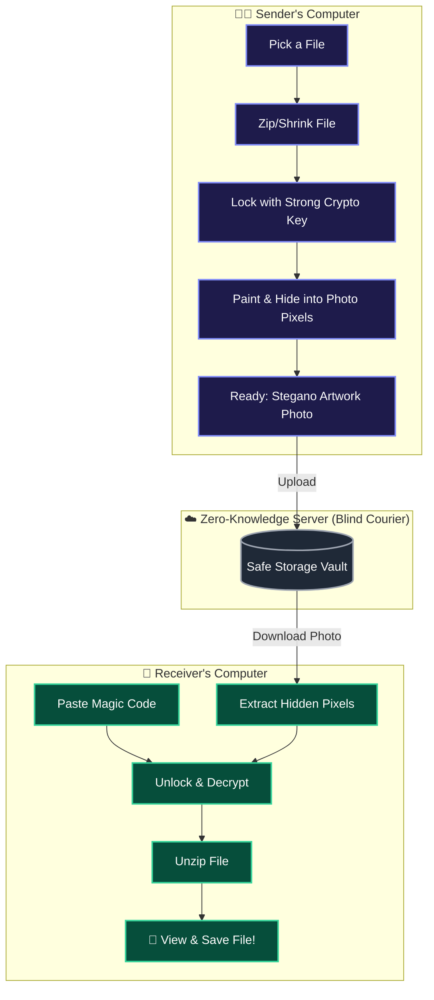
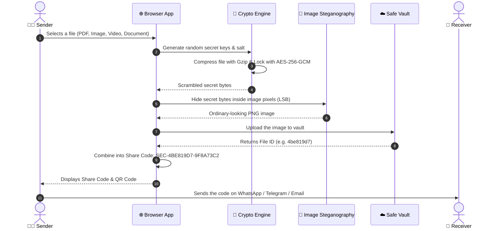
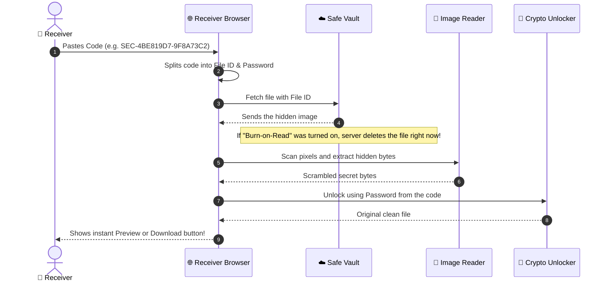
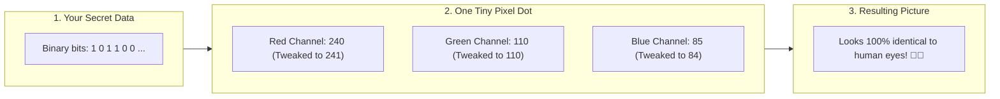

# 🛡️ SecureShare — Easy & Safe File Sharing

<div align="center">

[](https://react.dev/)
[](https://flask.palletsprojects.com/)
[](https://developer.mozilla.org/en-US/docs/Web/API/Web_Crypto_API)
[](https://en.wikipedia.org/wiki/Steganography)
[](LICENSE)

<p align="center">
  <strong>Share any file privately with bank-grade encryption, hidden inside ordinary-looking artwork images!</strong>
</p>

[How It Works (Simple Story)](#-how-it-works-in-simple-words) • [Visual Flowcharts & Explanations](#-visual-diagrams--step-by-step-teacher-guide) • [Cool Features](#-cool-features) • [Tech Stack](#-technology-stack) • [How to Run](#-how-to-run-locally) • [API Specification](#-api-specification)

</div>

---

## 🎒 How It Works in Simple Words

Imagine you want to send a secret letter to your best friend:

```
📄 Your File 
     ⬇️ (1. Pack & Shrink)
🗜️ Compressed tightly into a tiny bundle
     ⬇️ (2. Lock in a Safe)
🔒 Encrypted with a super strong mathematical lock (AES-256)
     ⬇️ (3. Hide in a Picture)
🖼️ Hidden inside the tiny colored dots (pixels) of a beautiful photo
     ⬇️ (4. Share the Magic Key)
🔑 Sent as a code: SEC-4BE819D7-9F8A73C2
     ⬇️ (5. Self-Destruct)
💥 File disappears from the server forever as soon as your friend opens it!
```

---

## 🗺️ Visual Diagrams & Step-by-Step Teacher Guide

---

### 1. Overall System Architecture
> 👨‍🏫 **Teacher's Note**: Think of this as the bird's-eye view. The sender locks the secret on their own laptop, sends it across, and only the receiver can unlock it. The server in the middle is just a blind courier—it can never see inside!



---

### 2. How Sending a File Works (Upload & Encryption)
> 👨‍🏫 **Teacher's Note**: Follow the numbered steps below to see what happens behind the scenes when you click **"Encrypt & Get Code"**:



#### 📖 Step-by-Step Breakdown for Students:
1. **You choose your file**: You drag and drop any file into the website.
2. **Your browser creates a lock**: It generates a unique random key that nobody else in the world knows.
3. **The file gets locked**: Using military-grade **AES-256**, your file turns into scrambled unreadable noise.
4. **The secret is painted into a picture**: The scrambled data is hidden inside the color shades of an image.
5. **Uploaded to the server**: Only the photo is sent to the server. The server **never** receives your password.
6. **You get your magic code**: A neat code like `SEC-4BE819D7-9F8A73C2` is generated for you to share!

---

### 3. How Receiving a File Works (Download & Decryption)
> 👨‍🏫 **Teacher's Note**: Here is how your friend uses the code to unlock the file:



#### 📖 Step-by-Step Breakdown for Students:
1. **Paste the code**: Your friend types or pastes the share code.
2. **Fetch the photo**: The browser downloads the camouflage image from the vault.
3. **Self-destruct (Burn-on-Read)**: If enabled, the server permanently deletes the file so it can never be downloaded again.
4. **Extract hidden data**: The browser inspects the photo's pixels and extracts the hidden scrambled data.
5. **Unlock the safe**: The browser uses the secret key inside the code to turn the scrambled data back into your original file.
6. **Enjoy the file**: Your friend can preview the PDF/photo right in their browser or save it to their computer!

---

### 4. How Steganography Hides Data in Image Pixels
> 👨‍🏫 **Teacher's Note**: How do we hide a secret inside a picture without anyone noticing? Every picture is made of millions of tiny dots called **pixels**. Each pixel has three colors: **Red (R)**, **Green (G)**, and **Blue (B)** with brightness from 0 to 255. We gently tweak the very last bit (Least Significant Bit) of each color!



- If Red color is `240` (binary `11110000`), we change just the last digit to `1` $\rightarrow$ `241` (binary `11110001`).
- The change in color is so tiny that **no human eye can see any difference!**
- But the computer can read every single bit back with 100% accuracy.

---

## 🌟 Cool Features

- 🔒 **Zero-Knowledge**: Everything is locked and unlocked inside your browser. The server never sees your plain files or passwords.
- 🖼️ **Image Camouflage (Steganography)**: Encrypted files look like ordinary space artwork photos.
- 💥 **Burn-on-Read**: Want maximum secrecy? Set it to auto-delete after the very first download.
- ⚡ **Direct WebRTC Mode**: Send files directly computer-to-computer (P2P) across your local WiFi or the Internet.
- 👁️ **Instant Quick View**: Preview PDFs, photos, and text files directly in the browser without even saving them to disk.
- ⏱️ **Auto Expiry**: Files automatically expire and get wiped clean after 1 hour, 4 hours, or 24 hours.

---

## 🛠️ Technology Stack

| Layer | Tool / Technology | What It Does |
| :--- | :--- | :--- |
| **Frontend** | React 18 + Vite | Fast, modern, responsive interactive web user interface |
| **Backend** | Python Flask 3.0 | Lightweight API to store and serve the encrypted files |
| **Database** | SQLite3 | Keeps track of file IDs, timers, and download counts |
| **Encryption** | Web Crypto API (AES-256-GCM + PBKDF2) | Bank-grade in-browser cryptographic security |
| **Steganography** | HTML5 Canvas LSB Engine | Reads and writes hidden secret bits in pixel color channels |
| **P2P Networking** | WebRTC + Socket.IO | Direct browser-to-browser high-speed data transfers |

---

## 📁 Project Structure

```
secureshare/
├── api/
│   └── index.py               # Python Flask API & WebRTC signaling
├── database/
│   └── .gitkeep               # Safe database folder
├── frontend/
│   ├── src/
│   │   ├── pages/
│   │   │   ├── Upload.jsx     # Send / Encrypt / Embed screen
│   │   │   └── Download.jsx   # Receive / Decrypt / Preview screen
│   │   ├── crypto.js          # Web Crypto API: AES-256-GCM & PBKDF2
│   │   ├── steganography.js   # Canvas pixel LSB encoder & extractor
│   │   ├── webrtc.js          # WebRTC P2P DataChannel connection
│   │   ├── App.jsx            # Main app router
│   │   └── App.css            # Dark mode neon styles
│   ├── index.html             # Main web entry
│   └── package.json           # Node packages
├── uploads/                   # Temporary encrypted storage
├── requirements.txt           # Python packages
└── README.md                  # Project documentation
```

---

## 💻 How to Run Locally

### Step 1: Start the Backend (Port 8000)
```powershell
pip install -r requirements.txt
python api/index.py
```

### Step 2: Start the Frontend (Port 5173)
```powershell
cd frontend
npm install
npm run dev
```

Open **`http://localhost:5173`** in your web browser!

---

## 📡 API Specification

| Method | URL | What It Does |
| :--- | :--- | :--- |
| `GET` | `/api/health` | Checks if the server is healthy and running |
| `POST` | `/api/upload` | Uploads an encrypted stegano picture blob |
| `GET` | `/api/file-info/<id>` | Gets file details (size, expiration, etc.) without downloading the file |
| `GET` | `/api/download/<id>` | Downloads the encrypted picture file |
| `DELETE`| `/api/files/<id>` | Manually deletes a file immediately |
| `GET` | `/api/stats` | Shows server statistics |

---

## 📜 License

This project is licensed under the **MIT License**.

<div align="center">
  <sub>Built with ❤️ for privacy, security, and simple learning.</sub>
</div>
