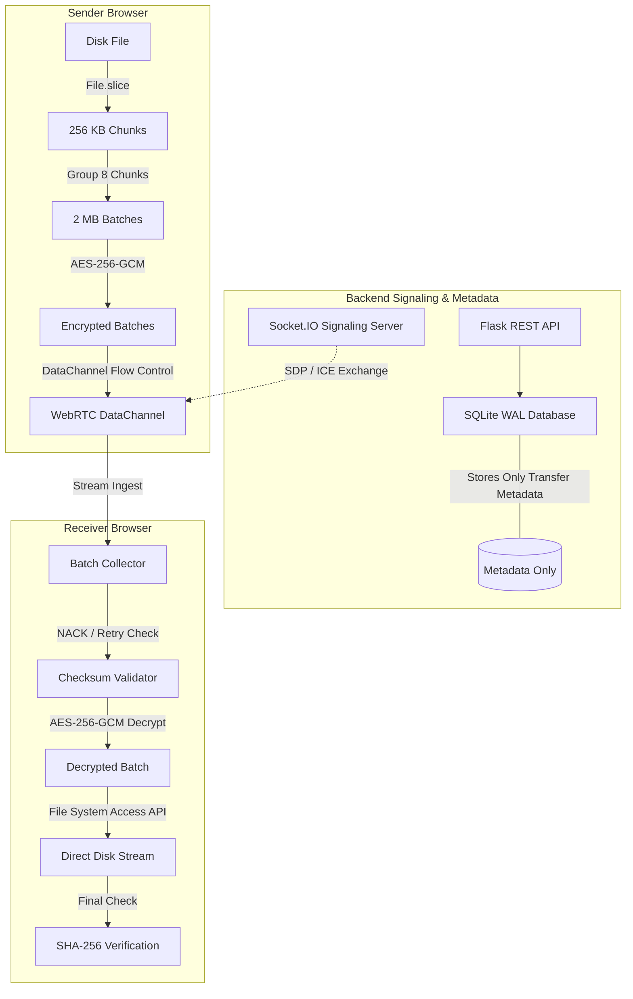
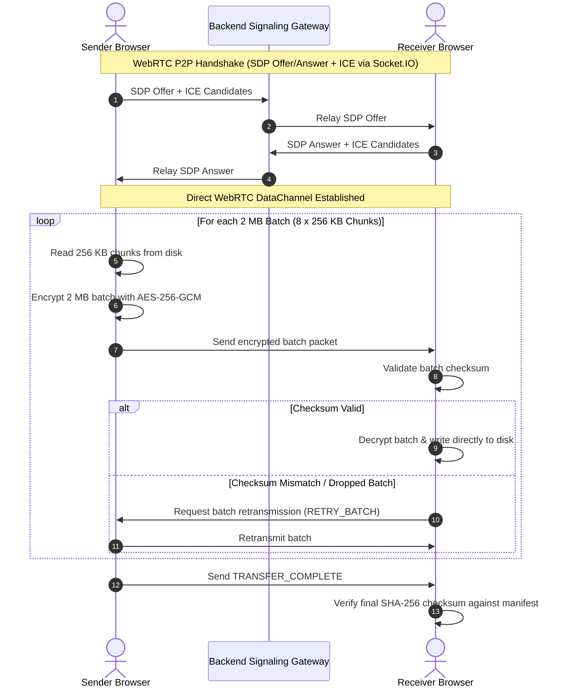

<div align="center">

# FileShare

### High-Performance, Zero-Knowledge Encrypted File Transfer with Stream and Batch Processing

[](https://www.python.org/)
[](https://flask.palletsprojects.com/)
[](https://react.dev/)
[](https://vitejs.dev/)
[](https://developer.mozilla.org/en-US/docs/Web/API/Web_Crypto_API)
[](https://vercel.com/)
[](LICENSE)

**Live Application:** [filesender-coral.vercel.app](https://filesender-coral.vercel.app/)  
**GitHub Repository:** [sujalkathait93-lab/filesender](https://github.com/sujalkathait93-lab/filesender)

---

</div>

## Overview

FileShare is a high-performance, privacy-first web application designed for secure, zero-knowledge file sharing. It implements a stream and batch processing architecture that enables users to transfer large files without buffering them completely in system memory.

Files are encrypted directly in the browser using hardware-accelerated **AES-256-GCM** before any byte is transmitted. The backend server acts strictly as a lightweight signaling gateway and metadata coordinator, storing only ephemeral session records in SQLite and never storing or inspecting plaintext files.

---

## Core Architecture and Features

### 1. Stream and Batch Processing Pipeline
- **Memory-Safe File Slicing:** Slices large files from disk using `File.slice()` in discrete 256 KB chunks (262,144 bytes), preventing browser and server RAM exhaustion.
- **Batch Grouping:** Automatically groups 8 consecutive chunks into 2 MB batches prior to encryption and network dispatch.
- **Per-Batch AES-256-GCM Encryption:** Encrypts each 2 MB batch independently using counter-derived initialization vectors (IVs), ensuring both confidentiality and cryptographic integrity.
- **Direct-to-Disk Streaming:** Receivers stream and write decrypted batches directly to disk using the browser-native File System Access API (`showSaveFilePicker` and `createWritable`), eliminating memory overhead on the receiving client.

### 2. Zero-Knowledge Cryptography
- **Client-Side Key Generation:** Generates high-entropy 256-bit keys and random 16-byte salts in the browser using the Web Crypto API.
- **Key Derivation (PBKDF2):** Derives encryption keys using PBKDF2 with SHA-256 and 100,000 iterations.
- **URL Fragment Isolation:** Appends the decryption key exclusively to the URL fragment (`#key=...`). The key is never transmitted over HTTP headers or stored on the server.
- **Access Proof Protocol:** Verifies download authorization using a SHA-256 hash digest (`fileshare-access:<password>`), authenticating requests without revealing the decryption key.

### 3. Reliability, Retries, and Integrity
- **Real-Time Flow Control:** WebRTC DataChannels utilize buffered amount backpressure monitoring (`bufferedAmountLowThreshold`) to prevent packet congestion.
- **Automatic Retry Mechanism:** Implements a NACK protocol over the DataChannel, enabling the receiver to detect missing chunks/batches and request immediate retransmission.
- **Pause, Resume, and Cancellation:** Both sender and receiver can pause, resume, or abort active transfers on demand with graceful resource cleanup.
- **End-to-End SHA-256 Verification:** Calculates pre-encryption and post-decryption SHA-256 hashes to guarantee byte-for-byte file integrity.

### 4. Privacy and Storage Rules
- **Metadata-Only SQLite Storage:** The SQLite database stores only transfer identifiers, chunk counts, byte sizes, checksums, and expiry timestamps. Plaintext files never touch server storage.
- **Burn-on-Read:** Transfers configured with Burn-on-Read are automatically and permanently purged from server memory and disk immediately after the first successful download.
- **Steganography Vault:** Supports embedding encrypted payloads into the Least Significant Bits (LSB) of PNG pixel arrays, providing plausible deniability.

---

## System Architecture



---

## Data Flow Sequences

### Stream and Batch Transfer Flow



---

## Tech Stack Breakdown

### Frontend Components

| Component | Technical Role |
| :--- | :--- |
| **React 18** | Manages UI state, transfer progress displays, modal dialogs, and component lifecycle. |
| **Vite 5** | Provides Hot Module Replacement (HMR) and compiles optimized production assets. |
| **Web Crypto API** | Executes hardware-accelerated AES-256-GCM encryption and PBKDF2 key derivation. |
| **Streams & File System API** | Facilitates progressive chunk reading and direct-to-disk write streaming without full RAM buffering. |
| **Socket.IO Client** | Manages real-time WebRTC signaling and peer discovery. |
| **Lucide Icons** | Vector iconography for interface actions and transfer state feedback. |

### Backend Components

| Component | Technical Role |
| :--- | :--- |
| **Python 3.12** | Core backend language providing high efficiency and modern type annotations. |
| **Flask 3.0** | Lightweight WSGI server managing REST endpoints and fallback cloud relay routes. |
| **Flask-SocketIO** | Handles bidirectional WebSocket signaling for WebRTC peer connection setup. |
| **SQLite (WAL Mode)** | High-concurrency metadata repository storing session state, chunk counts, and expiry times. |
| **Sliding Window Rate Limiter** | Enforces endpoint rate limits to protect signaling and relay routes from abuse. |
| **Cleanup Service** | Background worker thread that sweeps and purges expired transfer records. |

---

## REST API Reference

| Method | Endpoint | Required Headers / Params | Description |
| :--- | :--- | :--- | :--- |
| `GET` | `/api/health` | None | Reports server health and storage status. |
| `GET` | `/api/network-info` | None | Retrieves STUN/TURN configuration for WebRTC NAT traversal. |
| `POST` | `/api/upload` | Multipart Form | Uploads encrypted relay fallback blob and metadata. |
| `GET` | `/api/file-info/<id>` | `X-Access-Proof` | Retrieves transfer metadata without downloading the encrypted payload. |
| `GET` | `/api/download/<id>` | `X-Access-Proof`, `?preview=bool` | Streams encrypted binary blob (supports Burn-on-Read). |
| `POST` | `/api/transfers/<id>/token/refresh` | None | Refreshes share tokens and enforces session limits. |
| `DELETE` | `/api/files/<id>` | `X-Owner-Token` | Permanently deletes a transfer and its associated records. |

---

## Local Development and Setup

### Prerequisites
- Python 3.12 or higher
- Node.js 18 or higher and npm

### 1. Backend Service

```bash
# Set up virtual environment
python -m venv .venv
source .venv/bin/activate  # On Windows: .venv\Scripts\Activate.ps1

# Install requirements
pip install -r requirements.txt

# Start Flask API server (Port 8000)
python api/index.py
```

### 2. Frontend Application

```bash
# Navigate to frontend directory
cd frontend

# Install dependencies
npm install

# Start development server (Port 5173)
npm run dev
```

The web application will be accessible at `http://localhost:5173`.

---

## Verification and Testing

Execute the automated test suite to validate backend APIs, cryptographic functions, and state machines:

```bash
# Run backend integration test suite (56 tests)
python tests/test_backend.py

# Run browser cryptographic roundtrip validation
node tests/crypto-roundtrip.mjs

# Run preview and state machine tests
node tests/preview-and-states.test.mjs
```

---

## Deployment

1. Push your repository to GitHub:
   ```bash
   git add -A
   git commit -m "Deploy FileShare"
   git push origin main
   ```
2. Import the repository in [Vercel](https://vercel.com).
3. Set **Root Directory** to `.` (project root).
4. Configure environment variable:
   - `SECRET_KEY`: A secure 64-character random string.
5. Deploy. The React frontend and Flask API are built and deployed together using `vercel.json`.

---

## License

This project is licensed under the [MIT License](LICENSE).
