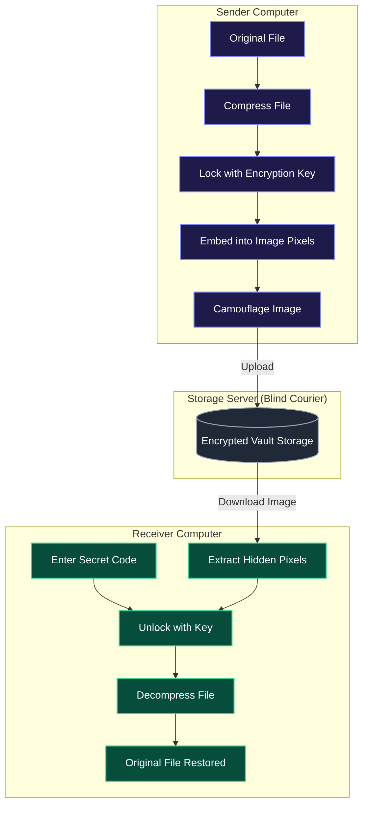
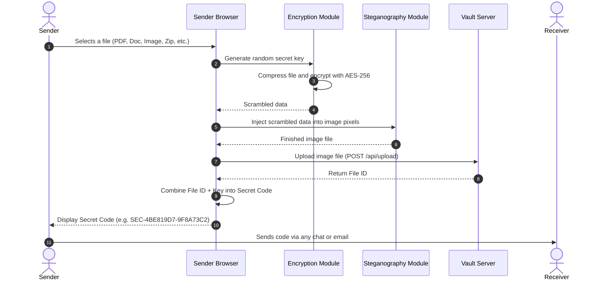
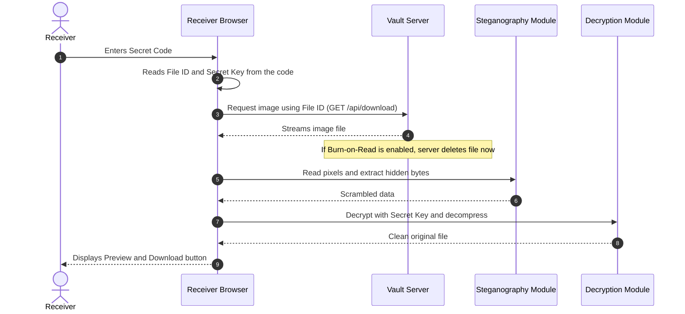
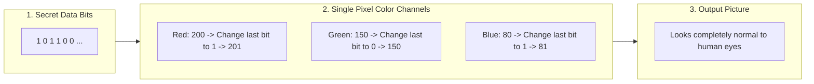

# SecureShare

[](https://react.dev/)
[](https://flask.palletsprojects.com/)
[](https://developer.mozilla.org/en-US/docs/Web/API/Web_Crypto_API)
[](https://en.wikipedia.org/wiki/Steganography)
[](LICENSE)

SecureShare is a private file sharing web application. It locks files directly inside your web browser before uploading them, hides the scrambled data inside an ordinary-looking picture, and gives you a single secret code to share with your receiver.

---

## Table of Contents

- [The Basic Idea (For Beginners)](#the-basic-idea-for-beginners)
- [System Diagrams and Explanations](#system-diagrams-and-explanations)
  - [1. The Big Picture](#1-the-big-picture)
  - [2. How Sending a File Works](#2-how-sending-a-file-works)
  - [3. How Receiving a File Works](#3-how-receiving-a-file-works)
  - [4. How Data is Hidden Inside an Image](#4-how-data-is-hidden-inside-an-image)
- [Key Features Explained Simply](#key-features-explained-simply)
- [Technologies Used](#technologies-used)
- [Project Folder Structure](#project-folder-structure)
- [How to Run on Your Computer](#how-to-run-on-your-computer)
- [API Reference](#api-reference)
- [License](#license)

---

## The Basic Idea (For Beginners)

When you send a file through most regular websites, the server can read and see everything inside your file.

SecureShare works differently:

1. **Your computer locks the file first**: Before anything leaves your browser, your file is scrambled into unreadable mathematical code (called AES-256 encryption).
2. **The scrambled file is hidden in a picture**: The scrambled data is packed into the tiny color dots (pixels) of a digital image. This technique is called **steganography**. To anyone looking at the image, it just looks like regular artwork.
3. **The server never knows the password**: The server only holds the image file. It cannot open it, cannot decrypt it, and cannot read what is inside.
4. **Your friend unlocks it with one code**: You send your friend a secret code (for example: `SEC-4BE819D7-9F8A73C2`). That code contains both the file location and the key to unlock it.

---

## System Diagrams and Explanations

### 1. The Big Picture

This diagram shows the complete journey of a file from the sender to the receiver.



**Explanation in plain English:**
- The sender's computer locks and hides the file into a photo.
- The server acts like a locked mailbox: it stores the photo, but it does not have the key to open it.
- The receiver's computer downloads the photo, uses the secret code to unlock it, and gets the original file back.

---

### 2. How Sending a File Works

Here is the exact step-by-step process that happens when you select a file and click **"Encrypt & Get Code"**:



**Step-by-step breakdown:**
1. **File Selection**: You drag and drop any file onto the website.
2. **Key Creation**: Your browser automatically generates a unique random password.
3. **Compression & Encryption**: The browser compresses the file to make it smaller, then locks it with AES-256 encryption.
4. **Image Camouflage**: The encrypted data is hidden directly inside the color channels of a digital image.
5. **Upload**: Only the image is sent to the server. The password stays on your computer.
6. **Code Generation**: The website creates a simple code (e.g., `SEC-4BE819D7-9F8A73C2`) for you to copy and share.

---

### 3. How Receiving a File Works

Here is what happens when your receiver receives the secret code and opens the file:



**Step-by-step breakdown:**
1. **Enter Code**: The receiver pastes the secret code into the "Receive" box.
2. **Download Image**: The browser downloads the image from the server.
3. **Self-Destruction (Burn-on-Read)**: If you selected "Burn-on-Read", the server completely erases the file from its disk immediately after this download.
4. **Extract & Unlock**: The browser extracts the hidden data from the image pixels and uses the key inside the code to unlock the original file.
5. **View or Save**: The receiver can view the document/image in their browser or save it to their computer.

---

### 4. How Data is Hidden Inside an Image

This technique is called **Least Significant Bit (LSB) Steganography**.

Every digital picture is made up of millions of tiny square dots called **pixels**. Each pixel gets its color from three values: **Red**, **Green**, and **Blue** (each ranging from 0 to 255).



**Why this works:**
- Changing a color number from `200` to `201` is a difference of less than 0.5% in brightness.
- The human eye cannot notice this tiny shift.
- But a computer can read every single bit back with 100% accuracy to recover your file.

---

## Key Features Explained Simply

- **Zero-Knowledge Privacy**: Your files are encrypted on your device. The server never gets the decryption key and cannot read your data.
- **Image Camouflage**: Files are hidden inside image pixels, making data transfers look like ordinary photo traffic.
- **Burn-on-Read**: When enabled, files are automatically destroyed from the server after they are downloaded once.
- **In-Browser Quick View**: PDF files, images, and text documents can be previewed directly inside the browser without saving to disk.
- **Automatic Expiration**: Files that are not downloaded are automatically purged after the chosen time limit (1 hour, 4 hours, or 24 hours).
- **Direct P2P Transfer (WebRTC)**: Allows direct computer-to-computer transfers over your local network or the Internet.

---

## Technologies Used

| Category | Technology | Purpose |
| :--- | :--- | :--- |
| **Frontend** | React 18 + Vite | User interface and client-side interactions |
| **Backend** | Python Flask 3.0 | API to receive and serve encrypted files |
| **Database** | SQLite3 | Stores file metadata, expiration timers, and download counts |
| **Cryptography** | Web Crypto API (AES-256-GCM + PBKDF2) | Client-side encryption and decryption |
| **Steganography** | HTML5 Canvas API | Reads and writes hidden data into pixel color channels |
| **Networking** | WebRTC + Socket.IO | Direct peer-to-peer data transfers |

---

## Project Folder Structure

```
secureshare/
├── api/
│   └── index.py               # Flask backend API & WebRTC signaling
├── database/
│   └── .gitkeep               # Database directory
├── frontend/
│   ├── src/
│   │   ├── pages/
│   │   │   ├── Upload.jsx     # Send & Encrypt page
│   │   │   └── Download.jsx   # Receive & Decrypt page
│   │   ├── crypto.js          # Encryption and key derivation
│   │   ├── steganography.js   # Image pixel encoder and decoder
│   │   ├── webrtc.js          # Direct peer-to-peer data transfer
│   │   ├── App.jsx            # Main app component
│   │   └── App.css            # Stylesheet
│   ├── index.html             # HTML entry point
│   └── package.json           # Frontend dependencies
├── uploads/                   # Temporary encrypted storage
├── requirements.txt           # Python backend dependencies
└── README.md                  # Project documentation
```

---

## How to Run on Your Computer

### Prerequisites
- **Node.js** (version 18 or higher)
- **Python** (version 3.10 or higher)

### 1. Start the Backend
Open a terminal in the project root folder:
```powershell
pip install -r requirements.txt
python api/index.py
```
The backend server will start on port `8000`.

### 2. Start the Frontend
Open a second terminal window:
```powershell
cd frontend
npm install
npm run dev
```
Open **`http://localhost:5173`** in your browser.

---

## API Reference

| Method | Route | Purpose |
| :--- | :--- | :--- |
| `GET` | `/api/health` | Check if the backend is running |
| `POST` | `/api/upload` | Upload an encrypted image file |
| `GET` | `/api/file-info/<id>` | Check file metadata (name, size, expiration) |
| `GET` | `/api/download/<id>` | Download the encrypted image file |
| `DELETE` | `/api/files/<id>` | Manually delete a file from the server |
| `GET` | `/api/stats` | View server statistics |

---

## License

This project is open source and available under the [MIT License](LICENSE).
