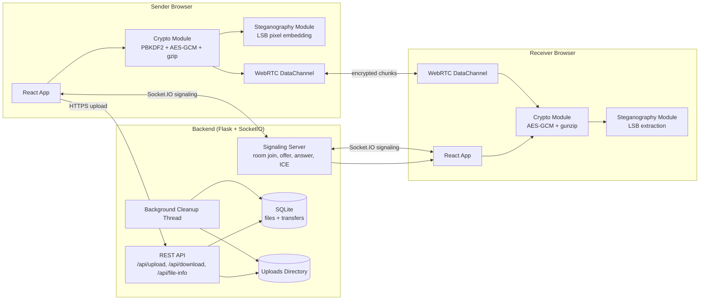
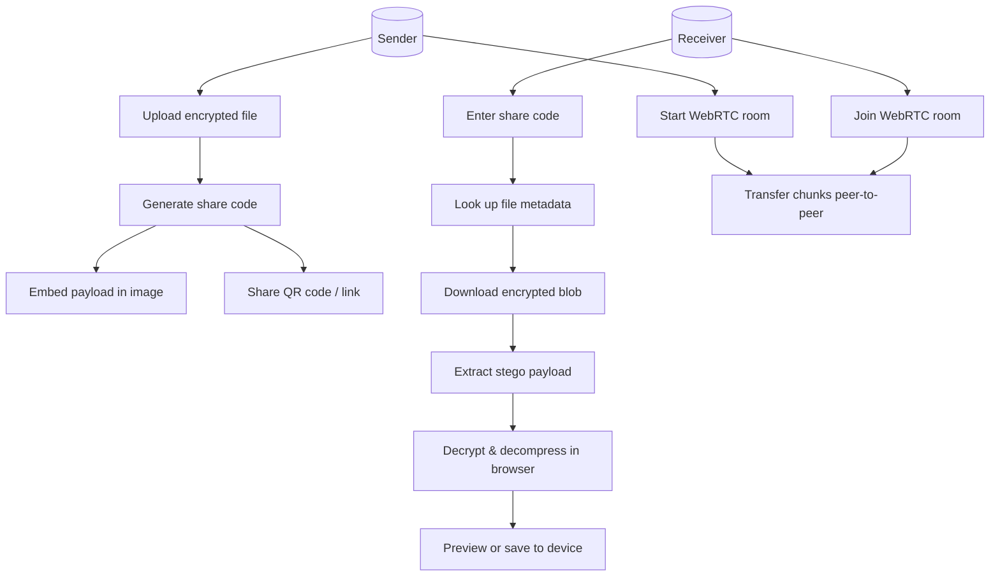
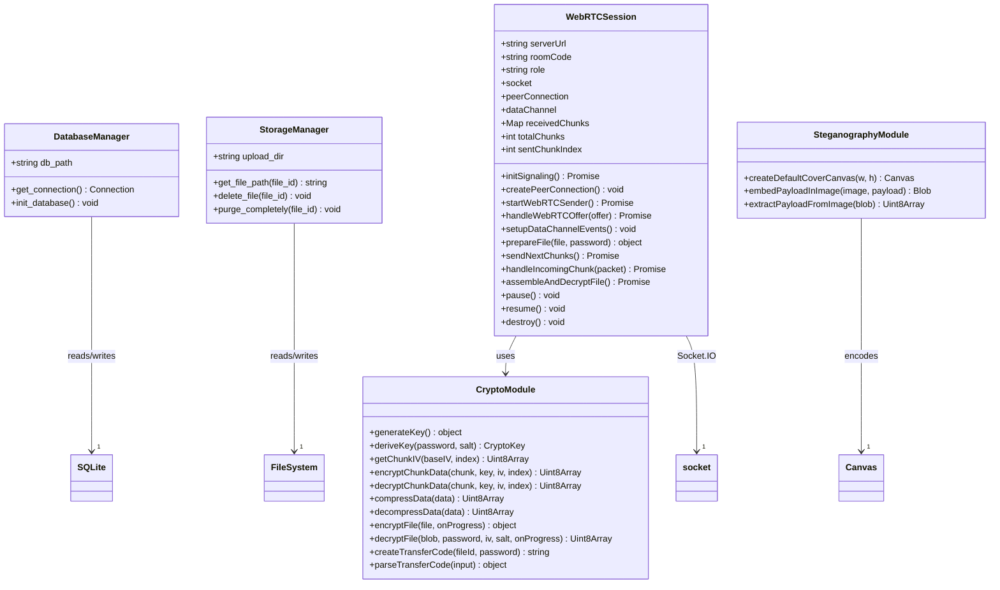
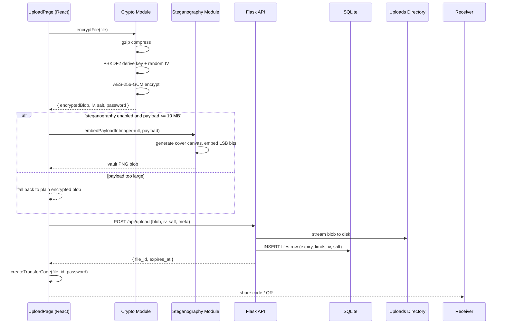
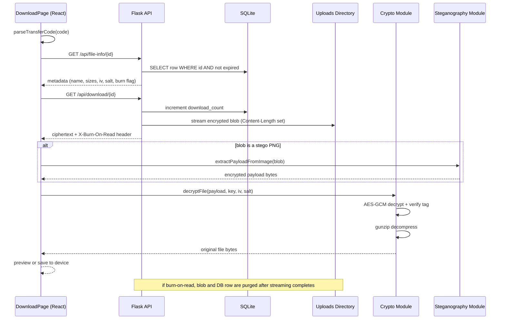
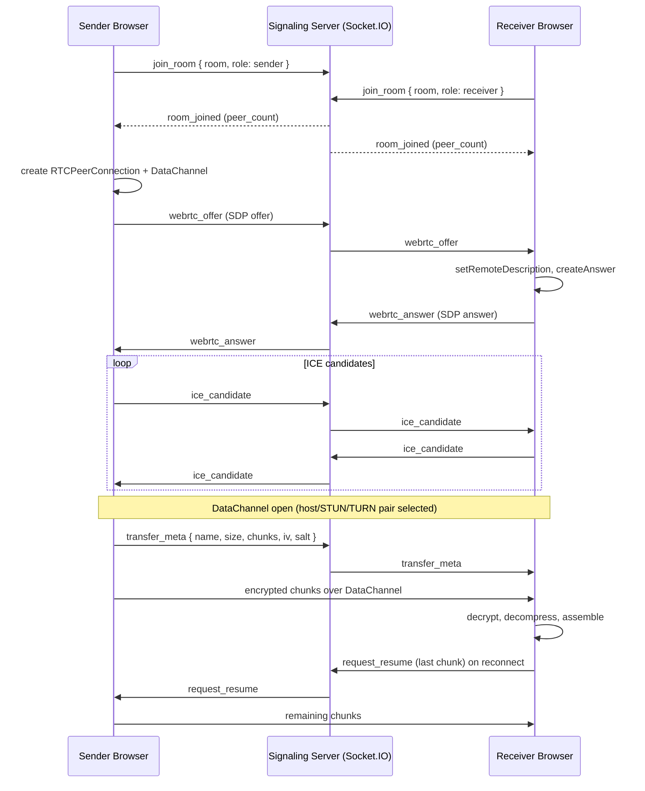
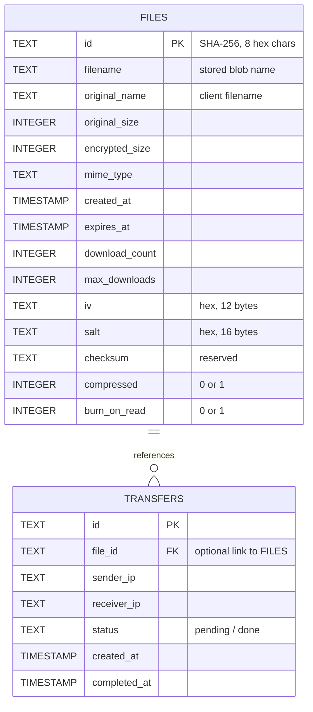
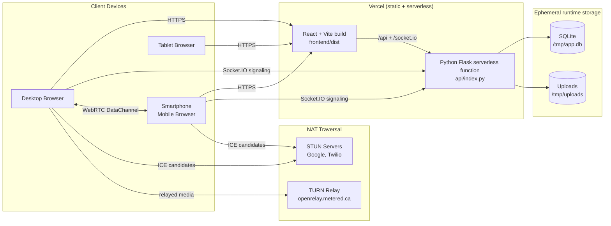

# SecureShare

**End-to-end encrypted file sharing with zero-knowledge storage, LSB steganographic vaults, and WebRTC peer-to-peer transfer.**

SecureShare is a private file-sharing web application. Files are compressed and encrypted inside the browser with AES-256-GCM before they ever leave the device. The encrypted payload can optionally be hidden inside the pixels of a PNG image (steganography), and the recipient receives a single share code that contains both the file ID and the decryption key. The server only ever stores ciphertext and metadata - it can never read a file.

---

## Table of Contents

1. [Key Features](#key-features)
2. [How It Works](#how-it-works)
3. [Architecture](#architecture)
   - [High-Level System Overview](#high-level-system-overview)
   - [Use Case Diagram](#use-case-diagram)
   - [Class Diagram](#class-diagram)
   - [Upload Sequence Diagram](#upload-sequence-diagram)
   - [Download Sequence Diagram](#download-sequence-diagram)
   - [WebRTC Signaling Sequence Diagram](#webrtc-signaling-sequence-diagram)
   - [Database ER Diagram](#database-er-diagram)
   - [Deployment Diagram](#deployment-diagram)
4. [Technology Stack](#technology-stack)
5. [Cryptography Deep Dive](#cryptography-deep-dive)
6. [Share Code Format](#share-code-format)
7. [API Reference](#api-reference)
8. [Project Structure](#project-structure)
9. [Local Development](#local-development)
10. [Deployment](#deployment)
11. [Security Guarantees](#security-guarantees)
12. [Limitations](#limitations)

---

## Key Features

- **Zero-Knowledge Storage** - Files are encrypted client-side with AES-256-GCM. The server stores only ciphertext, IV, and salt; the decryption key never leaves the browser.
- **Steganographic Vault** - Encrypted payloads can be embedded into the least-significant bits (LSB) of PNG pixels, disguising transfers as ordinary images.
- **Burn-on-Read** - Files are permanently purged from the server (disk + database) the moment they are downloaded.
- **Auto-Expiry** - Files expire after a configurable window (1 hour to 7 days) and are removed by a background cleanup task.
- **Download Limits** - Each file has a max download count; the limit is enforced atomically.
- **WebRTC Peer-to-Peer** - A signaling server (Flask-SocketIO) coordinates browser-to-browser DataChannel transfers with STUN/TURN NAT traversal and automatic LAN/WAN detection.
- **Chunked Transfers** - Files are split into 64 KB chunks with per-chunk IVs, flow control, pause/resume, live speed and ETA tracking.
- **Download Progress** - The API streams blobs with explicit `Content-Length`, so clients render accurate progress bars.
- **QR Code Sharing** - Uploads generate a scannable QR code for instant mobile download.
- **Fully Responsive UI** - Mobile-first design with safe-area insets, 44 px touch targets, and a full-screen preview sheet on phones.

---

## How It Works

SecureShare relies on three complementary techniques:

1. **Encryption (confidentiality).** A random 256-bit AES-GCM key is derived from a random password with PBKDF2 (100,000 iterations, random 16-byte salt). The file is gzip-compressed, then encrypted with AES-256-GCM using a random 12-byte IV. AES-GCM produces an authentication tag, so any tampering with the ciphertext is detected during decryption.

2. **Steganography (plausible deniability).** The encrypted bytes are written into the least-significant bit of the red, green, and blue channels of every pixel of a generated PNG cover image, preceded by a 10-byte magic header (`SECVAULTv1`) and a 4-byte length field. To an observer, the upload is just a picture. Payloads over ~10 MB are automatically uploaded as plain encrypted blobs instead.

3. **WebRTC (direct transfer).** Both peers connect to the signaling server, exchange SDP offers/answers and ICE candidates over Socket.IO, then stream encrypted chunks directly between browsers - the server only relays metadata.

The transfer code `SEC-<FILE_ID>-<KEY>` carries both halves of the puzzle: the file ID (server lookup) and the password (browser-side decryption). Without the code, neither the file nor its key is accessible.

---

## Architecture

### High-Level System Overview



The architecture is deliberately split: all cryptographic work happens in the browser, the server is a dumb matchmaker and storage box for ciphertext, and the database is only ever touched with encrypted metadata.

### Use Case Diagram



### Class Diagram



### Upload Sequence Diagram



### Download Sequence Diagram



### WebRTC Signaling Sequence Diagram



### Database ER Diagram



### Deployment Diagram



Note that on Vercel the SQLite database and uploads directory are ephemeral (`/tmp`), which is acceptable for a zero-knowledge design - encrypted blobs are meant to be short-lived. For persistent self-hosting, set `DB_PATH` and `UPLOAD_DIR` to persistent volumes.

---

## Technology Stack

| Layer | Technology | What it does | Why it was chosen |
| :--- | :--- | :--- | :--- |
| Frontend framework | **React 18** | Renders the single-page application (SPA) | Component model keeps the wizard-style upload/download flows maintainable; huge ecosystem |
| Build tool | **Vite 5** | Dev server with HMR, production bundler | Near-instant startup, modern ESM output, built-in dev proxy to the Flask API |
| Routing | **React Router 6** | Client-side routes: `/`, `/upload`, `/download/:fileId?` | Deep-linkable share URLs (`/download?code=SEC-...`) work on refresh |
| Icons | **lucide-react** | Lightweight SVG icon set | Crisp icons with zero icon-font layout shift |
| QR codes | **qrcode.react** | Renders scannable share-code QR codes | Zero-dependency SVG generation, no network calls |
| Client crypto | **Web Crypto API** | PBKDF2 key derivation, AES-256-GCM encrypt/decrypt | Native, hardware-accelerated cryptography inside the browser; keys never leave the device |
| Compression | **CompressionStream / DecompressionStream** | gzip compression before encryption | Reduces payload size before the expensive encryption pass; native browser support |
| Steganography | **HTML5 Canvas API** | LSB payload embedding/extraction on ImageData pixels | Bit-level control over pixel channels; PNG preserves exact pixel values |
| WebRTC | **RTCPeerConnection + RTCDataChannel** | Browser-to-browser binary transfer | Files bypass the server entirely; STUN/TURN handled by the platform |
| Signaling | **socket.io-client** | Real-time room coordination over WebSocket | Auto-reconnect, fallback polling, room primitives, tiny API |
| Backend | **Python Flask 3** | REST API server (upload, download, metadata, stats) | Minimal footprint, runs on Vercel serverless and Heroku (Procfile) alike |
| Realtime server | **Flask-SocketIO 5** | Signaling for WebRTC rooms and messages | First-class Flask integration, thread-based async mode with no extra runtime |
| CORS | **flask-cors** | Cross-origin access for LAN/WAN deployments | Lets the React app on :5173 talk to the API on :8000, and exposes custom `X-*` headers |
| Database | **SQLite 3** | Files and transfers metadata | Zero-configuration, file-based, transactional - perfect for ephemeral encrypted metadata |
| Web server | **gunicorn** | Production WSGI server (Procfile deployments) | Standard, battle-tested Python production server |
| Hosting | **Vercel** | Static frontend + Python serverless API | One-click deploy; rewrites route `/api/*` to `api/index.py` |

---

## Cryptography Deep Dive

All cryptographic operations run in the browser via the native Web Crypto API (`window.crypto.subtle`). The server never receives a password, a key, or plaintext.

### 1. Key Derivation (PBKDF2)

```javascript
// crypto.js - deriveKey
const keyMaterial = await crypto.subtle.importKey('raw', new TextEncoder().encode(password), 'PBKDF2', false, ['deriveKey']);
const key = await crypto.subtle.deriveKey(
  { name: 'PBKDF2', salt, iterations: 100000, hash: 'SHA-256' },
  keyMaterial,
  { name: 'AES-GCM', length: 256 },
  false,
  ['encrypt', 'decrypt']
);
```

- A random 16-byte **salt** is generated per file (`crypto.getRandomValues`).
- The password is stretched through **100,000 PBKDF2 iterations** with SHA-256.
- The result is a non-exportable **AES-256-GCM** `CryptoKey` bound to `encrypt`/`decrypt` usage.

### 2. Encryption (AES-256-GCM)

```javascript
// crypto.js - encryptFile
const encrypted = await crypto.subtle.encrypt({ name: 'AES-GCM', iv }, key, compressed);
```

- A random 12-byte **IV** is generated per file. The same IV is reused for every chunk of that file by incrementing the last 4 bytes with the chunk index (`getChunkIV`), which is safe for counter-based GCM usage as long as the IV space is not exhausted.
- AES-GCM appends a 128-bit **authentication tag**. Decryption fails if the ciphertext was modified, which also makes the transfer tamper-evident.

### 3. Steganographic Embedding (LSB)

```javascript
// steganography.js - embedPayloadInImage
// Full buffer: [10-byte magic "SECVAULTv1"][4-byte payload length][payload bytes]
// Each bit of the buffer replaces the LSB of one RGB channel byte (alpha is skipped).
pixels[i] = (pixels[i] & 0xfe) | bit;
```

- Capacity is `width * height * 3 / 8` bytes (3 bits per pixel).
- Extraction re-reads the LSBs, validates the magic header, then reads the 4-byte length field.
- PNG is used for output because it is lossless - JPEG would corrupt the embedded bits.
- Payloads larger than ~10 MB are rejected by the module and the UI falls back to plain encrypted upload.

### 4. Transfer Code

```javascript
// crypto.js - createTransferCode
return `SEC-${fileId.toUpperCase()}-${password.toUpperCase()}`;
```

The 8-hex-char file ID addresses the server; the 8-hex-char password derives the decryption key. `parseTransferCode` accepts full URLs, `SEC-...` codes, or raw 16-character hex, so pasting a whole share link works too.

---

## Share Code Format

| Part | Example | Purpose |
| :--- | :--- | :--- |
| Prefix | `SEC` | Human-readable marker for validation |
| File ID | `4BE819D7` | Lookup key in the `files` table |
| Password | `9F8A73C2` | PBKDF2 password; derives the AES key in the browser |

The code is case-insensitive on parse, survives URL pasting, and is what the QR code encodes.

---

## API Reference

Base path: `/api`

| Method | Endpoint | Description |
| :--- | :--- | :--- |
| GET | `/` | Service info, version, feature list |
| GET | `/api/health` | Liveness probe |
| GET | `/api/network-info` | Local IPs, port, STUN/TURN server list |
| POST | `/api/upload` | Upload encrypted blob + IV/salt + metadata (multipart form) |
| GET | `/api/file-info/{id}` | File metadata; 404 expired/unknown, 410 burned |
| GET | `/api/download/{id}` | Stream encrypted blob; `?preview=true` skips the download counter |
| DELETE | `/api/files/{id}` | Delete file immediately |
| GET | `/api/stats` | Total/active files, max size, expiry |

### Upload request (multipart/form-data)

| Field | Type | Notes |
| :--- | :--- | :--- |
| `file` | file | Encrypted blob (`.encrypted` or vault PNG) |
| `iv` | string | 12-byte IV as hex |
| `salt` | string | 16-byte salt as hex |
| `original_name` | string | Plaintext filename for the recipient |
| `original_size` | int | Size before encryption |
| `compressed` | int | 0/1 |
| `max_downloads` | int | 1-100 (forced to 1 for burn-on-read) |
| `burn_on_read` | int | 0/1 |
| `expiry_hours` | float | 0.25 - 720 |

### Download response headers

| Header | Meaning |
| :--- | :--- |
| `Content-Length` | Encrypted blob size (enables client progress bars) |
| `Content-Disposition` | RFC 5987 filename |
| `X-Original-Name` | URL-encoded original name |
| `X-Compressed` | Whether payload is gzip-compressed |
| `X-Burn-On-Read` | `1` if the file is purged after this stream |
| `X-IV`, `X-Salt` | Hex IV and salt needed for decryption |

### Signaling events (Socket.IO)

| Event | Direction | Payload |
| :--- | :--- | :--- |
| `join_room` / `leave_room` | client to server | `{ room, role }` |
| `room_joined` | server to room | `{ room, role, peer_count, meta }` |
| `webrtc_offer` / `webrtc_answer` | relayed | `{ offer/answer, sender_sid }` |
| `ice_candidate` | relayed | `{ candidate, sender_sid }` |
| `transfer_meta` | relayed | `{ meta }` |
| `request_resume` | relayed | `{ last_chunk_index }` |
| `transfer_status` | relayed | status string |
| `peer_disconnected` | server to room | `{ sid }` |

---

## Project Structure

```
secureshare/
├── api/
│   └── index.py              # Flask REST API + Socket.IO signaling server
├── database/                 # SQLite database (runtime)
├── uploads/                  # Encrypted blob storage (runtime)
├── frontend/
│   ├── index.html            # HTML entry, mobile meta tags
│   ├── vite.config.js        # Vite config + /api dev proxy
│   └── src/
│       ├── main.jsx          # React entry + router
│       ├── App.jsx           # Layout, nav, home page
│       ├── App.css           # Design system + responsive rules
│       ├── crypto.js         # PBKDF2, AES-GCM, gzip, transfer codes
│       ├── steganography.js  # LSB embedding/extraction on canvas
│       ├── webrtc.js         # WebRTCSession class + signaling client
│       └── pages/
│           ├── Upload.jsx    # Send flow (drop zone, wizard, share card)
│           └── Download.jsx  # Receive flow (code entry, preview, save)
├── requirements.txt          # Python dependencies
├── Procfile                  # Heroku web process
├── vercel.json               # Vercel build + rewrites + env
└── README.md
```

---

## Local Development

### Prerequisites

- Python 3.10+
- Node.js 18+

### 1. Start the backend

```powershell
pip install -r requirements.txt
python api/index.py
```

The Flask + Socket.IO server listens on `http://localhost:8000` (override with `PORT`).

### 2. Start the frontend

```powershell
cd frontend
npm install
npm run dev
```

Open `http://localhost:5173`. Vite proxies `/api` and `/socket.io` to `localhost:8000`, so no CORS configuration is needed in development.

### 3. Test end-to-end

1. On the Send page, drop any file and click **Encrypt & Get Code**.
2. Copy the `SEC-...` code.
3. On the Receive page (or in a second browser/incognito window), paste the code and download the file.
4. Verify the downloaded file matches the original byte-for-byte.

---

## Deployment

### Vercel

`vercel.json` already configures:

```json
{
  "buildCommand": "cd frontend && npm install && npm run build",
  "outputDirectory": "frontend/dist",
  "rewrites": [
    { "source": "/api/(.*)", "destination": "/api/index.py" },
    { "source": "/(.*)", "destination": "/index.html" }
  ],
  "env": { "DB_PATH": "/tmp/app.db", "UPLOAD_DIR": "/tmp/uploads" }
}
```

Note: Vercel serverless functions are stateless. SQLite and uploads live in ephemeral `/tmp`, so files do not survive function cold starts - by design, since every file expires within hours.

### Heroku (or any WSGI host)

```powershell
# Procfile
web: python api/index.py
```

For production WSGI, use `gunicorn`:

```powershell
gunicorn "api.index:app" -b 0.0.0.0:$PORT
```

WebSockets require a worker that supports them; Heroku's `web` dyno works with Flask-SocketIO's threading mode out of the box.

### Environment variables

| Variable | Default | Purpose |
| :--- | :--- | :--- |
| `PORT` | `8000` | HTTP port |
| `DB_PATH` | `database/app.db` (or `/tmp/app.db` on Vercel) | SQLite file location |
| `UPLOAD_DIR` | `uploads` (or `/tmp/uploads` on Vercel) | Encrypted blob directory |
| `MAX_FILE_SIZE` | `2147483648` (2 GB) | Hard upload limit |
| `SECRET_KEY` | dev-only fallback | Flask session secret |

---

## Security Guarantees

- **Confidentiality.** Plaintext never touches the server. AES-256-GCM with per-file salt/IV and PBKDF2 (100k iterations) protects the payload.
- **Integrity.** GCM authentication tags fail decryption on any modification; chunk IVs are derived deterministically per index.
- **Zero-knowledge.** The server stores only ciphertext + metadata. A database leak exposes filenames and sizes, but not contents or keys.
- **Self-destruction.** Burn-on-read files are purged from disk and the database inside the download stream's `finally` block; expired files are swept by the background cleanup thread.
- **Transport.** The UI is served over HTTPS; WebRTC negotiates encrypted DTLS for the DataChannel regardless of signaling transport.

---

## Limitations

- **Steganography capacity** - roughly 10 MB of payload per vault image; larger files fall back to plain encrypted blobs.
- **Ephemeral storage on Vercel** - `/tmp` is not persistent across function invocations; self-host for persistent long-lived shares.
- **Single-process signaling** - `active_rooms` lives in memory; horizontal scaling of the signaling server would require a Redis adapter.
- **Max file size** - capped at 2 GB (`MAX_FILE_SIZE`), mostly a browser memory constraint for client-side encryption.
- **GCM counter reuse** - chunk IVs increment within one file's IV; files larger than ~4 TB per key/IV pair would be unsafe (practically irrelevant).