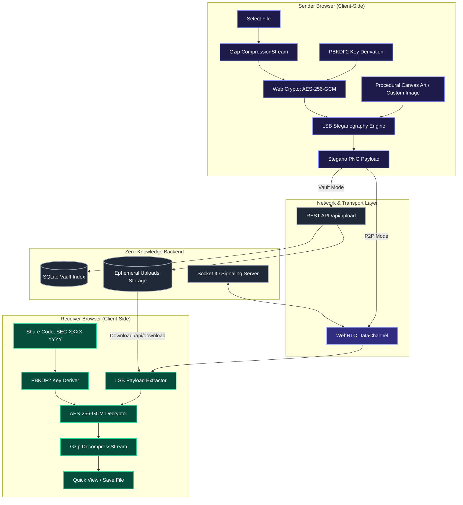
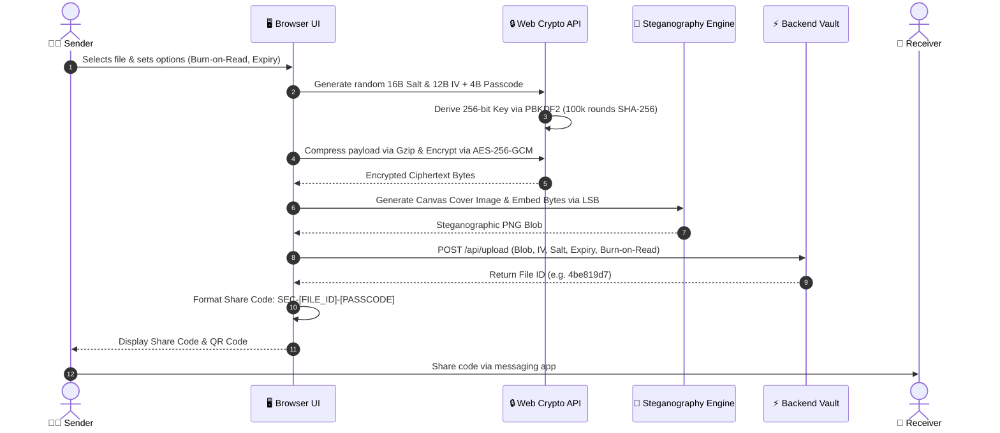
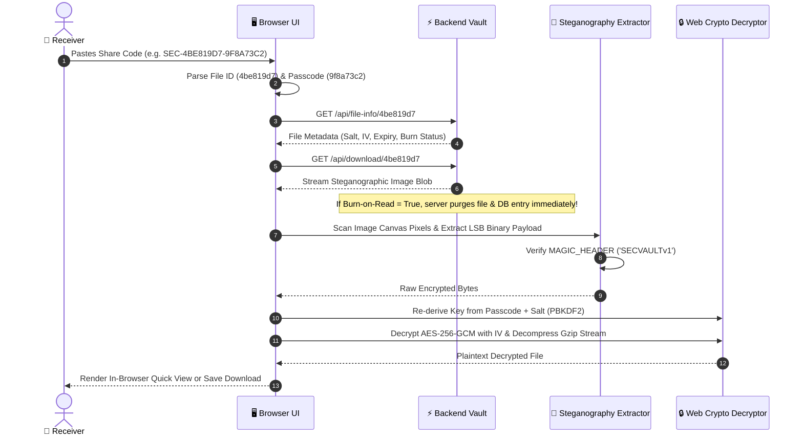
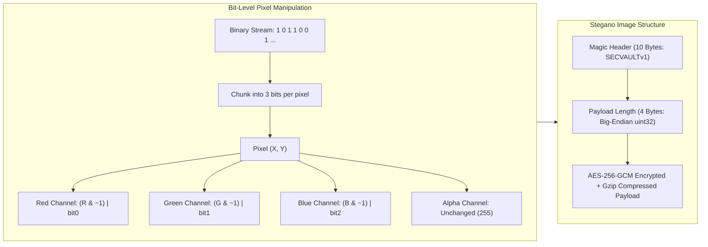

# 🛡️ SecureShare — Zero-Knowledge Encrypted File Sharing & Steganography Vault

<div align="center">

[](https://react.dev/)
[](https://flask.palletsprojects.com/)
[](https://developer.mozilla.org/en-US/docs/Web/API/Web_Crypto_API)
[](https://en.wikipedia.org/wiki/Steganography)
[](https://vercel.com)
[](LICENSE)

<p align="center">
  <strong>Next-Generation, Client-Side Encrypted File Transmission with LSB Steganographic Image Camouflage and WebRTC P2P DataChannels.</strong>
</p>

[Key Features](#-key-features) • [System Architecture](#-system-architecture) • [Cryptography & Steganography](#-cryptography--steganography-deep-dive) • [Workflows & Diagrams](#-uml--system-flowcharts) • [Tech Stack](#-technology-stack) • [Quick Start](#-quick-start) • [Deployment](#-deployment-guide) • [API Reference](#-api-specification)

</div>

---

## 🌟 Overview

**SecureShare** is an ultra-secure, zero-knowledge file sharing platform designed with privacy-first engineering. Files are compressed with Gzip, encrypted client-side using **AES-256-GCM** via the Web Crypto API, embedded into the RGB pixels of an auto-generated canvas artwork image using **Least Significant Bit (LSB) Steganography**, and shared using one-click cryptographic codes (`SEC-XXXX-YYYY`).

Because encryption and decryption occur exclusively inside the client's browser, the server never has access to plaintext files, keys, or passwords.

---

## ✨ Key Features

- 🔐 **Zero-Knowledge Client-Side Encryption**: AES-256-GCM encryption with PBKDF2 key derivation (100,000 iterations of SHA-256) entirely in the user's browser.
- 🎨 **LSB Pixel Steganography**: Encrypted binary ciphertext is embedded into individual RGB color channels of an artwork cover image, rendering data transfers completely indistinguishable from normal photo uploads.
- 🔥 **Burn-On-Read & Auto-Purge**: Files are permanently wiped from server memory and disk immediately after the first download or when their expiration timer runs out.
- ⚡ **WebRTC Direct P2P DataChannel**: Direct browser-to-browser transfer mode utilizing STUN/TURN NAT traversal for unlimited speed LAN/WAN direct sharing.
- 🗜️ **In-Browser Compression**: Native browser Gzip stream compression minimizes upload size and transfer latency before encryption.
- 👁️ **Zero-Disk In-Browser Quick View**: Decrypt and preview PDF documents, high-resolution images, code, and text directly inside the browser memory without saving to local disk.
- 📱 **QR Code & One-Click Share Codes**: Dual sharing mechanism using compact alphanumeric codes and high-density QR visual codes.
- ☁️ **Serverless & Edge Ready**: Native compatibility with Vercel Serverless Functions, Render, Railway, and Docker environments.

---

## 🏗️ System Architecture



---

## 📊 UML & System Flowcharts

### 1. Upload & Encryption Flowchart



---

### 2. Download, Extraction & Decryption Flowchart



---

### 3. Steganographic Pixel LSB Encoding Mechanism



---

## 🔒 Cryptography & Steganography Deep Dive

### 🛡️ End-to-End Cryptographic Specs

| Property | Implementation Specification |
| :--- | :--- |
| **Cipher Algorithm** | **AES-256-GCM** (Galois/Counter Mode) with 128-bit authentication tag |
| **Key Derivation** | **PBKDF2** with HMAC-SHA-256 |
| **Derivation Work Factor**| **100,000 Iterations** (protects against GPU brute-force attempts) |
| **Salt Specification** | **16 Bytes (128 bits)** cryptographically secure random values (`crypto.getRandomValues`) |
| **IV (Nonce)** | **12 Bytes (96 bits)** unique per encryption session |
| **Compression** | Streamed **Gzip** (`CompressionStream('gzip')`) prior to encryption |
| **Key Transport** | Zero server knowledge; password travels exclusively inside client share code fragments |

### 🖼️ Steganography Engine Specs

- **Carrier Media**: High-definition procedurally rendered nebula artwork canvas or user-uploaded PNG.
- **Encoding Scheme**: 3-bit Least Significant Bit (LSB) injection across $(R, G, B)$ color channels.
- **Integrity Validation**: 10-byte magic header verification (`SECVAULTv1` $[83, 69, 67, 86, 65, 85, 76, 84, 118, 49]$) + 32-bit payload length descriptor.
- **Visual Camouflage**: Max modification of $\pm 1$ luminance level per channel, rendering visual artifacts undetectable to human eyes and standard image scanners.

---

## 💻 Technology Stack

### **Frontend**
- **Framework**: React 18 with modern React Hooks & Functional Architecture
- **Build Tooling**: Vite 5 with HMR and optimized production bundling
- **Routing**: React Router v6
- **Cryptography Engine**: Native Browser `window.crypto.subtle` (Web Crypto API)
- **Networking**: `socket.io-client` & native WebRTC `RTCPeerConnection` / `RTCDataChannel`
- **UI & Icons**: Vanilla CSS3 Custom Properties Design System + Lucide Icons + `qrcode.react`

### **Backend**
- **Framework**: Python 3.10+ with Flask 3.0
- **Real-Time Signaling**: Flask-SocketIO / Simple-WebSocket for WebRTC session orchestration
- **Database**: SQLite3 (Optimized with WAL mode & zero-leak parameter binding)
- **Production Server**: Gunicorn WSGI + Gevent/Threading workers

### **Deployment & Cloud Infrastructure**
- **Vercel**: Native `@vercel/python` serverless API rewrite + static SPA edge hosting
- **Render / Railway / Docker**: Containerized Procfile WSGI server

---

## 📁 Project Structure

```
secureshare/
├── api/
│   └── index.py               # Flask REST API & WebRTC SocketIO signaling backend
├── database/
│   └── .gitkeep               # Database directory placeholder
├── frontend/
│   ├── public/                # Static assets & icons
│   ├── src/
│   │   ├── pages/
│   │   │   ├── Upload.jsx     # Send / Encrypt / Embed UI component
│   │   │   └── Download.jsx   # Receive / Decrypt / Preview UI component
│   │   ├── crypto.js          # Web Crypto API: AES-256-GCM + PBKDF2 + Gzip
│   │   ├── steganography.js   # HTML5 Canvas LSB pixel encoder & extractor
│   │   ├── webrtc.js          # WebRTC P2P DataChannel & STUN/TURN manager
│   │   ├── App.jsx            # Main app router & layout container
│   │   ├── App.css            # Cyberpunk dark mode design system & tokens
│   │   └── main.jsx           # React DOM root entrypoint
│   ├── index.html             # Single Page Application HTML shell
│   ├── package.json           # Frontend dependencies & scripts
│   └── vite.config.js         # Vite configuration with /api reverse proxy
├── uploads/                   # Ephemeral encrypted blob storage directory
├── Procfile                   # Process runner for Render / Railway / Heroku
├── vercel.json                # Vercel serverless functions & SPA rewrite rules
├── requirements.txt           # Python backend dependencies
└── README.md                  # Professional documentation
```

---

## 🚀 Quick Start

### Prerequisites
- **Node.js** (v18.0 or higher)
- **Python** (v3.10 or higher)
- **Git**

### 1. Clone the Repository
```bash
git clone https://github.com/sujalkathait93-lab/fileshare.git
cd fileshare
```

### 2. Run the Backend
```powershell
# Install dependencies
pip install -r requirements.txt

# Start the Flask API & Signaling Server (Port 8000)
python api/index.py
```

### 3. Run the Frontend
```powershell
# Open a new terminal tab
cd frontend

# Install Node dependencies
npm install

# Start Vite Development Server (Port 5173)
npm run dev
```

Open **`http://localhost:5173`** in your browser.

---

## 🌐 Deployment Guide

### Option 1: Deploy to Vercel (Recommended)

1. Fork or push this repository to your **GitHub** account.
2. Sign in to **[Vercel](https://vercel.com)**.
3. Click **"Add New..."** $\rightarrow$ **"Project"** $\rightarrow$ Select your `fileshare` repository.
4. Leave all build settings default (the included [`vercel.json`](vercel.json) handles building the frontend and routing the Python serverless API).
5. Click **"Deploy"**.

---

### Option 2: Deploy to Render / Railway / PaaS

1. Connect your repository to **Render** or **Railway**.
2. Select **Web Service**.
3. Build Command:
   ```bash
   pip install -r requirements.txt && cd frontend && npm install && npm run build
   ```
4. Start Command:
   ```bash
   gunicorn -w 1 --threads 8 -b 0.0.0.0:$PORT api.index:app
   ```

---

## 📡 API Specification

| Method | Endpoint | Description | Request Body / Parameters | Response |
| :--- | :--- | :--- | :--- | :--- |
| `GET` | `/api/health` | Server heartbeat & status | None | `{"status": "healthy", "timestamp": "..."}` |
| `POST` | `/api/upload` | Upload encrypted stegano blob | Multipart Form (`file`, `iv`, `salt`, `burn_on_read`, `expiry_hours`) | `{"file_id": "...", "share_url": "...", "expires_at": "..."}` |
| `GET` | `/api/file-info/<id>` | Fetch metadata without payload | None | `{"original_name": "...", "encrypted_size": 1234, ...}` |
| `GET` | `/api/download/<id>` | Stream encrypted ciphertext blob | Query: `?preview=true\|false` | Binary stream (`application/octet-stream`) with security headers |
| `DELETE` | `/api/files/<id>` | Instant hard deletion | None | `{"message": "File deleted"}` |
| `GET` | `/api/stats` | Vault statistics | None | `{"total_files": 42, "active_files": 12, ...}` |

---

## 📜 License

Distributed under the **MIT License**. See `LICENSE` for more information.

---

<div align="center">
  <sub>Built with ❤️ for privacy, cryptographic integrity, and security.</sub>
</div>
