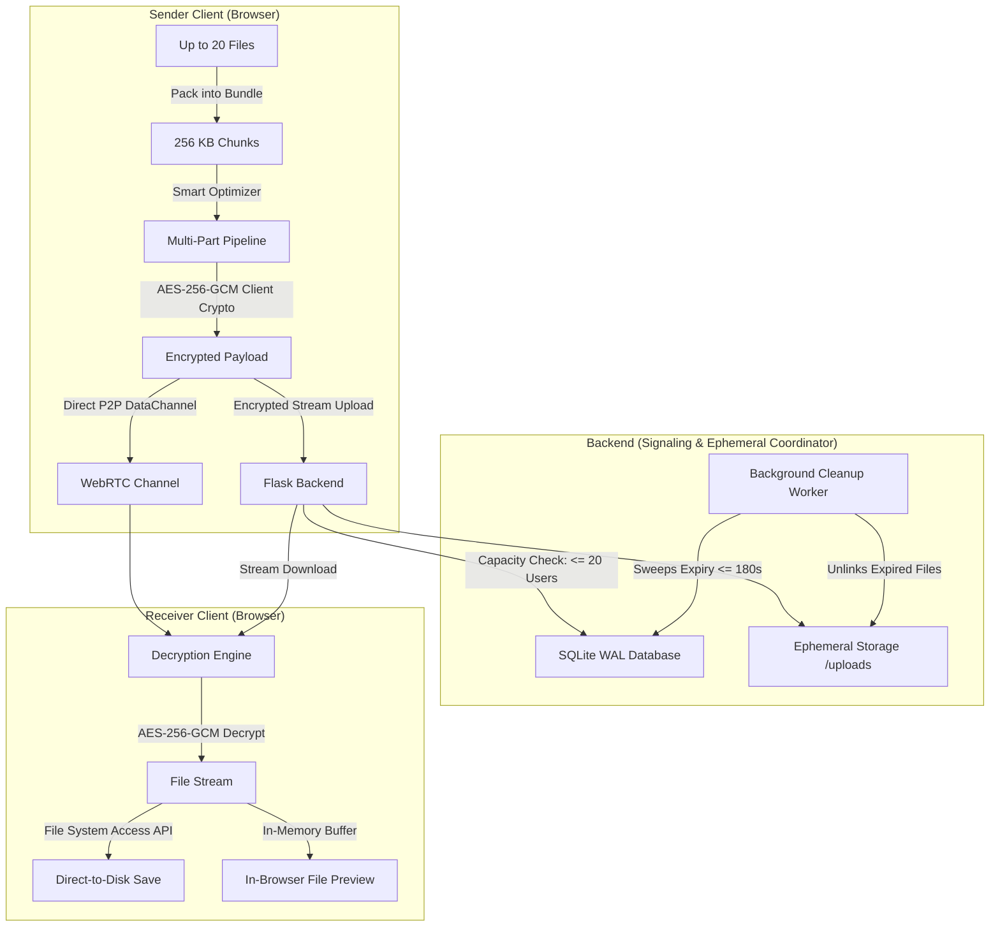
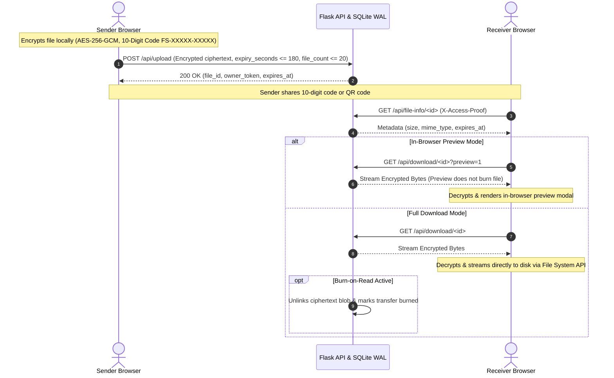

<div align="center">

# 🔒 FileShare

### High-Performance, Zero-Knowledge Encrypted File Transfer with Stream & Batch Processing

[](https://www.python.org/)
[](https://flask.palletsprojects.com/)
[](https://react.dev/)
[](https://vitejs.dev/)
[](https://developer.mozilla.org/en-US/docs/Web/API/Web_Crypto_API)
[](https://webrtc.org/)
[](https://vercel.com/)

Live Application: https://filesender-coral.vercel.app/  
GitHub Repository: https://github.com/sujalkathait93-lab/filesender

---

</div>

## 📌 Overview

**FileShare** is a high-performance, privacy-first web application designed for secure, zero-knowledge file sharing. Built with a stream-and-batch processing pipeline, it allows users to transfer up to 20 files per transfer (up to 1 GB total) safely without loading entire files into memory.

Files are encrypted directly in the user's browser using hardware-accelerated **AES-256-GCM** before transmission. The backend server functions strictly as an ephemeral metadata coordinator and optional fallback relay—**decryption keys and plaintext files never touch the server disk or memory**.

The system is engineered with strict privacy principles:
- **System Capacity:** Limited to **20 concurrent users** across the system.
- **Batch Transfer Limit:** Up to **20 files per transfer** (up to 1 GB total size).
- **Privacy-Preserving UI:** **Users never see download counts, download history, total downloads, or internal transfer statistics anywhere on sender or receiver UI.**

---

## ✨ Key Capabilities & Features

### 1. ⏱️ Ephemeral Expiry Countdown (15s up to 3 Minutes)
- **Strict Ephemeral Window:** Configurable live countdown options (**15s, 30s, 45s, 60s, 2 min, up to 3 min / 180s**).
- **Sub-Second Auto-Purge:** The moment the countdown timer expires, backend background cleanup sweeps immediately unlink the ciphertext file and purge SQLite metadata.
- **Visual Countdown:** Live countdown timers with animated progress track and auto-destruction notice.

### 2. 🔢 10-Digit Transfer Codes (`FS-XXXXX-XXXXX`)
- **Seamless Code Format:** 5-character file ID + 5-character decryption key combined into a standard 10-digit/char code (e.g., `FS-4BE81-9F8A7`).
- **Flexible Code Parsing:** Seamlessly accepts `FS-XXXXX-XXXXX`, `XXXXX-XXXXX`, raw 10-hex strings (`4BE819F8A7`), numeric strings, or direct URL hash links (`#key=...`).
- **One-Click Share:** Copy code, copy formatted instructions, or share directly via WhatsApp.

### 3. 📊 Clean Sender Dashboard (Streamlined 4-Card Layout)
The sender screen features an organized, responsive 4-card telemetry layout:
1. **File Details Box:** File thumbnail / icon, filename, total size, single/bundle file count, and in-browser preview button.
2. **Transfer Code Box:** Prominent 10-digit code with one-click copy, WhatsApp share, and share text copy.
3. **Expiry Countdown Box:** Real-time countdown timer in seconds with animated progress track.
4. **Security & Privacy Box:** Zero-Knowledge AES-256-GCM verification seal, client-side only keys, and Burn-on-Read / auto-purge status.

### 4. 🗂️ Sender Transfer Hub & Instant Cancellation
- **Active Share Monitoring:** Track active transfers simultaneously with live countdown timers and status pills.
- **Instant Revocation:** Senders can cancel and purge files immediately via `DELETE /api/cancel/<id>` with secret `X-Owner-Token` authentication.

### 5. 📥 Receiver Experience & In-Browser Preview
- **Pre-Download Inspection:** Inspect photos, audio, video, PDFs, code, and text directly in-browser before saving to disk.
- **Clean Verification Telemetry:** Displays transfer size, AES-256-GCM encryption, live countdown timer, and verified E2E security badge without exposing download statistics.
- **Burn-on-Read Self-Destruction:** Files marked with Burn-on-Read automatically self-destruct from the server immediately after download completion.

### 6. 🌐 Multiple Transfer Modes
- **Cloud Encrypted Relay:** AES-256-GCM ciphertext stored temporarily until download or expiry countdown completes.
- **WebRTC Direct P2P:** Direct browser-to-browser streaming via DataChannels with **zero intermediary server storage**.
- **Steganography Image Vault:** Inconspicuously conceals encrypted bytes inside standard PNG pixel arrays (<10 MB).

### 7. 🧹 Zero Tracking & One-Click Privacy Purge
- **No Tracking Cookies:** Zero persistent tracking cookies or user accounts required.
- **Session Data Purge:** Dedicated Settings & Privacy tool to wipe all session tokens, cookie records, blob memory URLs, and transfer histories in one click.

---

## 🏛️ System Architecture



---
---

## 🔄 Transfer Flow Sequence



---

## 🛠️ Tech Stack Breakdown

### Frontend
| Technology | Role |
| :--- | :--- |
| **React 18** | Modular UI components, state machines, and reactive telemetry cards. |
| **Vite 5** | High-speed build tooling and optimized bundle compilation. |
| **Web Crypto API** | Hardware-accelerated client-side AES-256-GCM encryption & PBKDF2 key derivation. |
| **WebRTC & Socket.IO** | Peer-to-peer data channels for direct device-to-device transfers. |
| **File System Access API** | Direct-to-disk streaming writes for high memory efficiency. |
| **QRCode.react** | SVG-rendered dynamic QR codes. |
| **Lucide React** | Clean vector iconography. |

### Backend
| Technology | Role |
| :--- | :--- |
| **Python 3.12+ / Flask 3.0** | Ephemeral REST API coordinator and chunk streaming router. |
| **SQLite (WAL Mode)** | High-concurrency relational metadata storage with indexed expiry sweeps. |
| **Threaded Cleaner** | Background worker enforcing sub-second cleanup of transfers expired within 15s–180s. |
| **Pytest** | Comprehensive integration testing covering security, capacity, TTL, and rate limits. |

---

## 🔌 REST API Reference

| Method | Endpoint | Required Headers / Params | Description |
| :--- | :--- | :--- | :--- |
| `GET` | `/api/health` | None | Reports server health, storage engine, and cleanup daemon status. |
| `GET` | `/api/network-info` | None | Retrieves STUN configuration for WebRTC NAT traversal. |
| `POST` | `/api/upload` | Multipart Form (`file`, `expiry_seconds`, `file_count`, etc.) | Uploads encrypted payload with metadata (enforces 20-user & 20-file limits). |
| `POST` | `/api/upload-chunk` | Multipart Form (`file_id`, `chunk_index`, `chunk_data`) | Uploads individual chunk slice for multi-part transfers. |
| `POST` | `/api/finalize-chunked` | JSON (`file_id`, `total_chunks`, `checksum`) | Finalizes and stitches chunked transfer. |
| `GET` | `/api/file-info/<id>` | `X-Access-Proof` | Retrieves file metadata and expiry without downloading payload. |
| `GET` | `/api/download/<id>` | `X-Access-Proof`, optional `?preview=1` | Streams encrypted binary blob. |
| `POST` | `/api/transfers/<id>/token/refresh` | `X-Owner-Token` | Rotates QR access token (up to 5 refreshes). |
| `DELETE` | `/api/cancel/<id>` | `X-Owner-Token` | Senders permanently delete files and purge metadata on demand. |

---

## 💻 Local Development Setup

### Prerequisites
- **Python 3.12+**
- **Node.js 18+** and **npm**

### 1. Backend Setup
```bash
# Create virtual environment
python -m venv .venv
source .venv/bin/activate  # On Windows: .venv\Scripts\Activate.ps1

# Install dependencies
pip install -r requirements.txt

# Start backend API (Port 8000)
python api/index.py
```

### 2. Frontend Setup
```bash
# Navigate to frontend folder
cd frontend

# Install packages
npm install

# Start Vite development server (Port 5173)
npm run dev
```

Visit application in browser at: `http://localhost:5173`

---

## 🧪 Verification and Testing

Execute the automated test suites to validate encryption, API endpoints, state machines, and countdown TTL sweeps:

```bash
# Run 59 Backend Integration Tests
python tests/test_backend.py
pytest -s

# Run Frontend Cryptographic & State Machine Tests (61 tests)
node tests/preview-and-states.test.mjs

# Run Smart Transfer Optimizer & Chunk Plan Tests (75 tests)
node tests/smart-optimizer.test.mjs

# Run End-to-End Cryptographic Roundtrip Test (10 tests)
node tests/crypto-roundtrip.mjs

# Build production bundle
cd frontend && npm run build
```

---

## 📄 License

This project is open source and available under the [MIT License](LICENSE).
